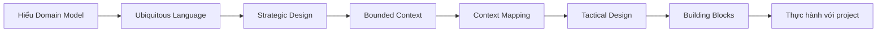

# Domain-Driven Design (DDD)

## Dành cho sinh viên đang học Spring Boot

Nếu bạn đang quen với **mô hình 3 lớp** (Controller-Service-Repository), tài liệu này sẽ giúp bạn hiểu **khi nào và tại sao** cần nâng cấp lên DDD.

!!! warning "Lưu ý quan trọng"
    DDD **KHÔNG PHẢI** thay thế cho mô hình 3 lớp. Với project đơn giản, CRUD thông thường, **mô hình 3 lớp vẫn là lựa chọn tốt nhất**. DDD chỉ cần thiết khi nghiệp vụ trở nên phức tạp.

## Bạn đã biết gì?

Trong các môn học Spring Boot, bạn đã làm quen với:

```java
// Controller - Nhận request
@RestController
public class UserController {
    @Autowired UserService userService;
    
    @PostMapping("/users")
    public UserDTO createUser(@RequestBody UserRequest request) {
        return userService.createUser(request);
    }
}

// Service - Xử lý business logic
@Service
public class UserService {
    @Autowired UserRepository userRepository;
    
    public UserDTO createUser(UserRequest request) {
        User user = new User();
        user.setName(request.getName());
        user.setEmail(request.getEmail());
        return userRepository.save(user);
    }
}

// Repository - Truy cập database
public interface UserRepository extends JpaRepository<User, Long> {
}
```

**Mô hình này hoạt động tốt cho:**
- ✅ CRUD đơn giản (thêm, sửa, xóa, tìm)
- ✅ Logic nghiệp vụ đơn giản
- ✅ Project nhỏ, deadline gấp
- ✅ Team thiếu kinh nghiệm

## Vấn đề xuất hiện khi project phức tạp

Giả sử bạn làm hệ thống Banking, có yêu cầu:

> "Chuyển tiền từ tài khoản A sang B, phải kiểm tra: số dư đủ, tài khoản không bị khóa, không vượt hạn mức chuyển trong ngày, phải ghi log, gửi notification, cập nhật báo cáo..."

**Với mô hình 3 lớp truyền thống:**

```java
@Service
public class TransferService {
    public void transfer(Long fromId, Long toId, BigDecimal amount) {
        // Lấy 2 tài khoản
        Account from = accountRepo.findById(fromId).orElseThrow();
        Account to = accountRepo.findById(toId).orElseThrow();
        
        // Kiểm tra hết các điều kiện ở đây - RẤT DÀI!
        if (from.getBalance().compareTo(amount) < 0) {
            throw new InsufficientBalanceException();
        }
        if (from.isLocked() || to.isLocked()) {
            throw new AccountLockedException();
        }
        // ... 20 dòng kiểm tra khác ...
        
        // Thực hiện chuyển tiền
        from.setBalance(from.getBalance().subtract(amount));
        to.setBalance(to.getBalance().add(amount));
        
        accountRepo.save(from);
        accountRepo.save(to);
        
        // Ghi log, gửi notification...
    }
}
```

**Vấn đề:**
- ❌ Service quá phình to (God Service)
- ❌ Logic nghiệp vụ nằm rải rác
- ❌ Khó test riêng từng rule
- ❌ Entity chỉ là data holder (Anemic Model)
- ❌ Dễ vi phạm business rules (ai cũng có thể `setBalance()`)

## DDD giải quyết như thế nào?

**DDD đưa logic vào đúng chỗ:**

```java
// Entity có behavior, tự bảo vệ business rules
public class Account {
    private Money balance;
    private AccountStatus status;
    private DailyTransferLimit dailyLimit;
    
    // Logic nghiệp vụ ở trong Entity
    public void debit(Money amount) {
        if (status.isLocked()) {
            throw new AccountLockedException();
        }
        if (balance.isLessThan(amount)) {
            throw new InsufficientBalanceException();
        }
        if (!dailyLimit.canTransfer(amount)) {
            throw new DailyLimitExceededException();
        }
        
        this.balance = balance.subtract(amount);
        // Raise event để notification service lắng nghe
        registerEvent(new MoneyDebited(this.id, amount));
    }
    
    public void credit(Money amount) {
        this.balance = balance.add(amount);
        registerEvent(new MoneyCredited(this.id, amount));
    }
}

// Service chỉ còn điều phối
@Service
public class TransferService {
    public void transfer(AccountId fromId, AccountId toId, Money amount) {
        Account from = accountRepo.findById(fromId);
        Account to = accountRepo.findById(toId);
        
        from.debit(amount);    // Business rules tự động check
        to.credit(amount);
        
        accountRepo.save(from);
        accountRepo.save(to);
    }
}
```

**Lợi ích:**
- ✅ Logic tập trung trong Entity (dễ tìm)
- ✅ Entity tự bảo vệ mình (không ai `setBalance()` lung tung được)
- ✅ Service mỏng, chỉ điều phối
- ✅ Dễ test từng rule riêng
- ✅ Code đọc giống tài liệu nghiệp vụ

## Domain-Driven Design là gì?

**Domain-Driven Design (DDD)** là phương pháp phát triển phần mềm tập trung vào **nghiệp vụ** (domain), không phải công nghệ.

!!! tip "Nguyên tắc cốt lõi"
    **"Code phải nói ngôn ngữ của nghiệp vụ"** - Khi Product Owner nói "chuyển tiền", code phải có method `transfer()`, không phải `updateBalance()`

## So sánh: Mô hình 3 lớp vs DDD

| Khía cạnh | Mô hình 3 lớp | DDD |
|-----------|---------------|-----|
| **Entity** | Chỉ chứa data (getter/setter) | Chứa cả data + behavior |
| **Business Logic** | Trong Service | Trong Entity + Service |
| **Service** | Phình to, nhiều logic | Mỏng, chỉ điều phối |
| **Validation** | Trong Service hoặc Controller | Trong Entity (tự bảo vệ) |
| **Phù hợp** | CRUD đơn giản | Nghiệp vụ phức tạp |
| **Độ phức tạp** | Đơn giản, dễ học | Phức tạp hơn, cần học |

## Khi nào nên học DDD?

### ✅ Bạn NÊN học DDD nếu:
- Làm project có **nghiệp vụ phức tạp** (banking, insurance, e-commerce lớn)
- Thường xuyên **thay đổi business rules**
- Lộ trình học DDD (dành cho sinh viên)

!!! tip "Học từng bước, đừng vội"
    Không cần học hết một lúc! Mỗi concept đều có ví dụ code cụ thể.

### Tuần 1-2: Cơ bản (BẮT BUỘC)
- **Bước 1**: Đọc [Tactical Design](tactical-design.md) - Entity, Value Object
- **Bước 2**: Xem [Example Project](example-project.md) - Code Banking System
- **Thực hành**: Chuyển 1 Service trong project cũ sang Rich Domain Model

### Tuần 3-4: Nâng cao (NÊN HỌC)
- **Bước 3**: Đọc tiếp Tactical Design - Aggregate, Domain Service
- **Bước 4**: Đọc [Building Blocks](building-blocks.md) - Domain Events, Specifications
- **Thực hành**: Thêm validation rules vào Entity

### Tùy chọn: Cho ai muốn đi sâu
- **Bước 5**: [Strategic Design](strategic-design.md) - Khi project có >3 modules
- **Bước 6**: [Advanced Patterns](advanced-patterns.md) - CQRS, Event Sourcing (cho senior)

## Tài liệu theo thứ tự đọc

### 📚 Bắt đầu ở đây
1. **[Tactical Design](tactical-design.md)** ⭐ BẮT ĐẦU TẠI ĐÂY
   - Entity có business logic (không còn Anemic)
   - Value Object cho các giá trị không đổi
   - So sánh với mô hình 3 lớp

2. **[Example Project](example-project.md)** ⭐ XEM CODE THỰC TẾ
   - Banking System hoàn chỉnh
   - Code Spring Boot cụ thể
   - Có thể copy về chạy thử

### 📖 Đọc tiếp khi đã hiểu cơ bản
3. **[Building Blocks](building-blocks.md)**
   - Domain Events (giao tiếp giữa modules)
   - Specifications (tách rules phức tạp)
   - Factories (tạo object phức tạp)

### 🎓 Dành cho ai muốn thành expert (không bắt buộc)
4. **[Strategic Design](strategic-design.md)** - Khi làm hệ thống lớn
5. **[Advanced Patterns](advanced-patterns.md)** - Event Sourcing, CQRS (level senior)

## Câu hỏi thường gặp (FAQs)

??? question "Có bắt buộc phải dùng DDD không?"
    **KHÔNG.** Mô hình 3 lớp vẫn tốt cho 80% project. DDD chỉ cần khi nghiệp vụ phức tạp.

??? question "DDD có làm code phức tạp hơn không?"
    **CÓ**, nhưng đổi lại code **dễ hiểu hơn** và **dễ thay đổi hơn** về lâu dài. Trade-off là đáng.

??? question "Phải học hết tài liệu này mới dùng được DDD?"
    **KHÔNG.** Chỉ cần học **Entity, Value Object, Aggregate** (Tactical Design) là đủ bắt đầu.

??? question "DDD có áp dụng được cho microservices không?"
    **CÓ.** Mỗi microservice là 1 Bounded Context. Nhưng học monolith trước đã!

??? question "Mình học xong DDD có tìm được việc dễ hơn không?"
    **CÓ.** Các công ty lớn (VNG, FPT Software, Viettel...) hay dùng DDD. Senior dev phải biết DDD.

## Khi nào nên dùng DDD?

✅ **NÊN dùng DDD khi:**

- Domain nghiệp vụ phức tạp
- Dự án dài hạn cần maintain
- Cần sự cộng tác chặt chẽ giữa developer và domain experts
- Hệ thống có nhiều subdomain

❌ **KHÔNG NÊN dùng DDD khi:**

- Ứng dụng đơn giản, CRUD thuần túy
- Dự án ngắn hạn, prototype
- Domain nghiệp vụ đơn giản, ít logic
- Team thiếu kinh nghiệm với DDD

## Lợi ích của DDD

1. **Code dễ hiểu**: Code phản ánh domain thực tế
2. **Collaboration tốt hơn**: Developer và domain experts nói cùng một ngôn ngữ
3. **Flexible architecture**: Dễ thay đổi khi nghiệp vụ thay đổi
4. **Focus vào business value**: Tập trung vào giải quyết vấn đề nghiệp vụ

## Nguồn tham khảo

!!! info "Tài liệu chính thống"
    - **Eric Evans** - [Domain-Driven Design: Tackling Complexity in the Heart of Software](https://www.amazon.com/Domain-Driven-Design-Tackling-Complexity-Software/dp/0321125215) (2003) - Sách gốc định nghĩa DDD
    - **Vaughn Vernon** - [Implementing Domain-Driven Design](https://www.amazon.com/Implementing-Domain-Driven-Design-Vaughn-Vernon/dp/0321834577) (2013) - Hướng dẫn triển khai DDD
    - **Martin Fowler** - [Domain-Driven Design](https://martinfowler.com/bliki/DomainDrivenDesign.html) - Tổng quan về DDD từ Martin Fowler
    - **Eric Evans** - [DDD Reference](http://domainlanguage.com/ddd/reference/) - Tài liệu tham khảo chính thức

## Roadmap học DDD



---

**Bắt đầu với:** [Strategic Design →](strategic-design.md)
