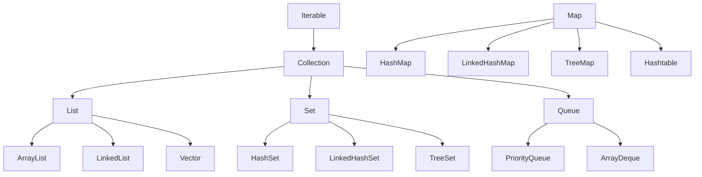

# Collections Framework

Java Collections Framework cung cấp các cấu trúc dữ liệu và thuật toán để lưu trữ và xử lý nhóm các đối tượng.

## Tổng quan

### Hierarchy



### So sánh các Collection

| Collection | Ordered | Sorted | Duplicates | Null | Thread-safe |
|------------|---------|--------|------------|------|-------------|
| ArrayList | Yes | No | Yes | Yes | No |
| LinkedList | Yes | No | Yes | Yes | No |
| HashSet | No | No | No | Yes (1) | No |
| LinkedHashSet | Yes | No | No | Yes (1) | No |
| TreeSet | Yes | Yes | No | No | No |
| HashMap | No | No | No (key) | Yes | No |
| LinkedHashMap | Yes | No | No (key) | Yes | No |
| TreeMap | Yes | Yes | No (key) | No | No |

---

## List Interface

### ArrayList

**ArrayList** sử dụng mảng động, truy cập nhanh theo index.

```java
import java.util.ArrayList;
import java.util.List;

public class ArrayListExample {
    public static void main(String[] args) {
        // Khởi tạo
        List<String> fruits = new ArrayList<>();
        
        // Thêm phần tử
        fruits.add("Apple");
        fruits.add("Banana");
        fruits.add("Orange");
        fruits.add(1, "Mango");  // Thêm vào vị trí 1
        
        // Truy cập
        String first = fruits.get(0);  // "Apple"
        
        // Cập nhật
        fruits.set(0, "Grape");
        
        // Xóa
        fruits.remove("Banana");
        fruits.remove(0);  // Xóa theo index
        
        // Kiểm tra
        boolean hasOrange = fruits.contains("Orange");
        int size = fruits.size();
        boolean isEmpty = fruits.isEmpty();
        
        // Duyệt
        for (String fruit : fruits) {
            System.out.println(fruit);
        }
        
        // Java 8+ forEach
        fruits.forEach(System.out::println);
    }
}
```

### LinkedList

**LinkedList** sử dụng danh sách liên kết đôi, thêm/xóa nhanh ở đầu/cuối.

```java
import java.util.LinkedList;

public class LinkedListExample {
    public static void main(String[] args) {
        LinkedList<String> list = new LinkedList<>();
        
        // Thêm đầu/cuối
        list.addFirst("First");
        list.addLast("Last");
        list.add("Middle");
        
        // Lấy đầu/cuối
        String first = list.getFirst();
        String last = list.getLast();
        
        // Xóa đầu/cuối
        list.removeFirst();
        list.removeLast();
        
        // Sử dụng như Stack
        list.push("Top");
        String top = list.pop();
        
        // Sử dụng như Queue
        list.offer("End");
        String head = list.poll();
    }
}
```

### So sánh ArrayList vs LinkedList

| Thao tác | ArrayList | LinkedList |
|----------|-----------|------------|
| get(index) | O(1) | O(n) |
| add(element) | O(1)* | O(1) |
| add(index, element) | O(n) | O(n) |
| remove(index) | O(n) | O(n) |
| addFirst/addLast | O(n) / O(1) | O(1) / O(1) |

*O(1) amortized, có thể O(n) khi resize

---

## Set Interface

### HashSet

**HashSet** không cho phép phần tử trùng lặp, không đảm bảo thứ tự.

```java
import java.util.HashSet;
import java.util.Set;

public class HashSetExample {
    public static void main(String[] args) {
        Set<String> colors = new HashSet<>();
        
        colors.add("Red");
        colors.add("Green");
        colors.add("Blue");
        colors.add("Red");  // Không thêm được - đã tồn tại
        
        System.out.println(colors.size());  // 3
        
        // Kiểm tra tồn tại - O(1)
        boolean hasRed = colors.contains("Red");
        
        // Xóa
        colors.remove("Green");
        
        // Duyệt (thứ tự không đảm bảo)
        for (String color : colors) {
            System.out.println(color);
        }
    }
}
```

### LinkedHashSet

**LinkedHashSet** giữ nguyên thứ tự thêm vào.

```java
import java.util.LinkedHashSet;
import java.util.Set;

public class LinkedHashSetExample {
    public static void main(String[] args) {
        Set<String> colors = new LinkedHashSet<>();
        
        colors.add("Red");
        colors.add("Green");
        colors.add("Blue");
        
        // Duyệt theo thứ tự thêm vào
        for (String color : colors) {
            System.out.println(color);  // Red, Green, Blue
        }
    }
}
```

### TreeSet

**TreeSet** tự động sắp xếp các phần tử.

```java
import java.util.TreeSet;
import java.util.Set;

public class TreeSetExample {
    public static void main(String[] args) {
        Set<Integer> numbers = new TreeSet<>();
        
        numbers.add(5);
        numbers.add(2);
        numbers.add(8);
        numbers.add(1);
        
        // Tự động sắp xếp
        for (Integer num : numbers) {
            System.out.println(num);  // 1, 2, 5, 8
        }
        
        // TreeSet với Comparator tùy chỉnh
        Set<String> names = new TreeSet<>((a, b) -> b.compareTo(a));  // Giảm dần
        names.add("Alice");
        names.add("Bob");
        names.add("Charlie");
        // Charlie, Bob, Alice
    }
}
```

---

## Map Interface

### HashMap

**HashMap** lưu trữ cặp key-value, key không trùng lặp.

```java
import java.util.HashMap;
import java.util.Map;

public class HashMapExample {
    public static void main(String[] args) {
        Map<String, Integer> scores = new HashMap<>();
        
        // Thêm
        scores.put("Alice", 95);
        scores.put("Bob", 87);
        scores.put("Charlie", 92);
        
        // Truy cập
        Integer aliceScore = scores.get("Alice");  // 95
        Integer unknownScore = scores.get("Unknown");  // null
        
        // getOrDefault
        Integer score = scores.getOrDefault("Unknown", 0);  // 0
        
        // Cập nhật
        scores.put("Alice", 98);  // Ghi đè
        
        // putIfAbsent - chỉ thêm nếu chưa có
        scores.putIfAbsent("Alice", 100);  // Không thay đổi
        
        // Kiểm tra
        boolean hasAlice = scores.containsKey("Alice");
        boolean has100 = scores.containsValue(100);
        
        // Xóa
        scores.remove("Bob");
        scores.remove("Charlie", 92);  // Xóa nếu value khớp
        
        // Duyệt
        for (Map.Entry<String, Integer> entry : scores.entrySet()) {
            System.out.println(entry.getKey() + ": " + entry.getValue());
        }
        
        // Java 8+ forEach
        scores.forEach((key, value) -> {
            System.out.println(key + ": " + value);
        });
        
        // Duyệt keys
        for (String key : scores.keySet()) {
            System.out.println(key);
        }
        
        // Duyệt values
        for (Integer value : scores.values()) {
            System.out.println(value);
        }
    }
}
```

### TreeMap

**TreeMap** tự động sắp xếp theo key.

```java
import java.util.TreeMap;
import java.util.Map;

public class TreeMapExample {
    public static void main(String[] args) {
        Map<String, Integer> scores = new TreeMap<>();
        
        scores.put("Charlie", 92);
        scores.put("Alice", 95);
        scores.put("Bob", 87);
        
        // Tự động sắp xếp theo key
        scores.forEach((k, v) -> System.out.println(k + ": " + v));
        // Alice: 95
        // Bob: 87
        // Charlie: 92
    }
}
```

---

## Queue Interface

### PriorityQueue

**PriorityQueue** - hàng đợi ưu tiên, phần tử nhỏ nhất được lấy ra trước.

```java
import java.util.PriorityQueue;
import java.util.Queue;

public class PriorityQueueExample {
    public static void main(String[] args) {
        // Min-heap (mặc định)
        Queue<Integer> minHeap = new PriorityQueue<>();
        minHeap.offer(5);
        minHeap.offer(2);
        minHeap.offer(8);
        
        while (!minHeap.isEmpty()) {
            System.out.println(minHeap.poll());  // 2, 5, 8
        }
        
        // Max-heap
        Queue<Integer> maxHeap = new PriorityQueue<>((a, b) -> b - a);
        maxHeap.offer(5);
        maxHeap.offer(2);
        maxHeap.offer(8);
        
        while (!maxHeap.isEmpty()) {
            System.out.println(maxHeap.poll());  // 8, 5, 2
        }
    }
}
```

### ArrayDeque

**ArrayDeque** - có thể dùng như Stack hoặc Queue.

```java
import java.util.ArrayDeque;
import java.util.Deque;

public class ArrayDequeExample {
    public static void main(String[] args) {
        Deque<String> deque = new ArrayDeque<>();
        
        // Như Stack (LIFO)
        deque.push("First");
        deque.push("Second");
        deque.push("Third");
        
        System.out.println(deque.pop());  // Third
        System.out.println(deque.pop());  // Second
        
        // Như Queue (FIFO)
        deque.offer("A");
        deque.offer("B");
        deque.offer("C");
        
        System.out.println(deque.poll());  // A
        System.out.println(deque.poll());  // B
    }
}
```

---

## Collections Utility Class

```java
import java.util.Collections;
import java.util.ArrayList;
import java.util.List;

public class CollectionsUtilExample {
    public static void main(String[] args) {
        List<Integer> numbers = new ArrayList<>();
        numbers.add(5);
        numbers.add(2);
        numbers.add(8);
        numbers.add(1);
        
        // Sắp xếp
        Collections.sort(numbers);  // [1, 2, 5, 8]
        Collections.sort(numbers, Collections.reverseOrder());  // [8, 5, 2, 1]
        
        // Đảo ngược
        Collections.reverse(numbers);
        
        // Xáo trộn
        Collections.shuffle(numbers);
        
        // Tìm min/max
        int min = Collections.min(numbers);
        int max = Collections.max(numbers);
        
        // Binary search (list phải được sắp xếp)
        Collections.sort(numbers);
        int index = Collections.binarySearch(numbers, 5);
        
        // Thay thế tất cả
        Collections.fill(numbers, 0);  // [0, 0, 0, 0]
        
        // Tạo list bất biến
        List<String> immutableList = Collections.unmodifiableList(
            new ArrayList<>(List.of("A", "B", "C"))
        );
        
        // Tạo list synchronized (thread-safe)
        List<String> syncList = Collections.synchronizedList(new ArrayList<>());
    }
}
```

---

## Comparable vs Comparator

### Comparable

```java
public class Student implements Comparable<Student> {
    private String name;
    private int score;
    
    public Student(String name, int score) {
        this.name = name;
        this.score = score;
    }
    
    @Override
    public int compareTo(Student other) {
        return this.score - other.score;  // Sắp xếp theo score tăng dần
    }
}

// Sử dụng
List<Student> students = new ArrayList<>();
students.add(new Student("Alice", 95));
students.add(new Student("Bob", 87));
Collections.sort(students);  // Sắp xếp theo score
```

### Comparator

```java
import java.util.Comparator;

// Comparator riêng biệt
Comparator<Student> byName = (s1, s2) -> s1.getName().compareTo(s2.getName());
Comparator<Student> byScoreDesc = (s1, s2) -> s2.getScore() - s1.getScore();

// Sử dụng
Collections.sort(students, byName);
Collections.sort(students, byScoreDesc);

// Comparator chaining
Comparator<Student> byScoreThenName = Comparator
    .comparingInt(Student::getScore)
    .thenComparing(Student::getName);
```

---

## Bài tập thực hành

!!! example "Bài tập 1"
    Viết chương trình đếm số lần xuất hiện của mỗi từ trong một đoạn văn bản.

??? success "Gợi ý"
    ```java
    Map<String, Integer> wordCount = new HashMap<>();
    String[] words = text.toLowerCase().split("\\s+");
    for (String word : words) {
        wordCount.merge(word, 1, Integer::sum);
    }
    ```

!!! example "Bài tập 2"
    Tìm K phần tử lớn nhất trong một mảng số nguyên.

??? success "Gợi ý"
    Sử dụng PriorityQueue (min-heap) với size K.

## Tiếp theo

- [Exception Handling](exception.md)
