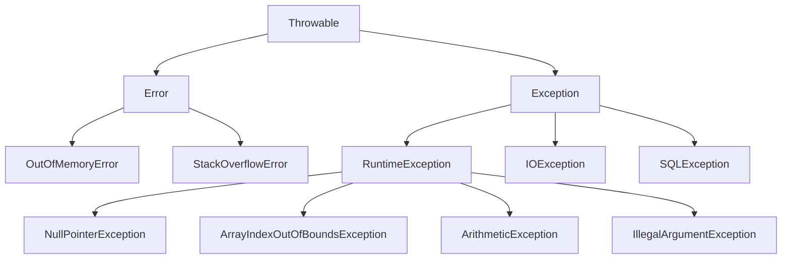

# Exception Handling

Exception Handling là cơ chế xử lý các lỗi xảy ra trong quá trình chạy chương trình, giúp chương trình không bị crash đột ngột.

## Tổng quan

### Exception Hierarchy



### Phân loại Exception

| Loại | Mô tả | Ví dụ |
|------|-------|-------|
| **Checked Exception** | Bắt buộc xử lý, compiler kiểm tra | IOException, SQLException |
| **Unchecked Exception** | Không bắt buộc xử lý | NullPointerException, ArrayIndexOutOfBoundsException |
| **Error** | Lỗi nghiêm trọng, không nên catch | OutOfMemoryError, StackOverflowError |

---

## Try-Catch-Finally

### Cú pháp cơ bản

```java
try {
    // Code có thể gây ra exception
    int result = 10 / 0;
} catch (ArithmeticException e) {
    // Xử lý exception
    System.out.println("Lỗi: " + e.getMessage());
} finally {
    // Luôn được thực thi (dù có exception hay không)
    System.out.println("Finally block");
}
```

### Catch nhiều exception

```java
try {
    // Code có thể gây ra nhiều loại exception
    String str = null;
    System.out.println(str.length());
    
    int[] arr = {1, 2, 3};
    System.out.println(arr[10]);
    
} catch (NullPointerException e) {
    System.out.println("Null pointer: " + e.getMessage());
    
} catch (ArrayIndexOutOfBoundsException e) {
    System.out.println("Array index out of bounds: " + e.getMessage());
    
} catch (Exception e) {
    // Catch-all cho các exception khác
    System.out.println("Other exception: " + e.getMessage());
}
```

### Multi-catch (Java 7+)

```java
try {
    // Code
} catch (NullPointerException | ArrayIndexOutOfBoundsException e) {
    // Xử lý chung cho cả 2 loại exception
    System.out.println("Error: " + e.getMessage());
}
```

### Try-with-resources (Java 7+)

Tự động đóng resource khi kết thúc block.

```java
// Trước Java 7
BufferedReader reader = null;
try {
    reader = new BufferedReader(new FileReader("file.txt"));
    String line = reader.readLine();
} catch (IOException e) {
    e.printStackTrace();
} finally {
    if (reader != null) {
        try {
            reader.close();
        } catch (IOException e) {
            e.printStackTrace();
        }
    }
}

// Java 7+ với try-with-resources
try (BufferedReader reader = new BufferedReader(new FileReader("file.txt"))) {
    String line = reader.readLine();
    System.out.println(line);
} catch (IOException e) {
    e.printStackTrace();
}
// reader tự động được đóng

// Nhiều resources
try (
    FileInputStream fis = new FileInputStream("input.txt");
    FileOutputStream fos = new FileOutputStream("output.txt")
) {
    // Sử dụng fis và fos
} catch (IOException e) {
    e.printStackTrace();
}
```

---

## Throw và Throws

### Throw

Ném exception thủ công.

```java
public void setAge(int age) {
    if (age < 0) {
        throw new IllegalArgumentException("Age cannot be negative");
    }
    if (age > 150) {
        throw new IllegalArgumentException("Age cannot be greater than 150");
    }
    this.age = age;
}

public void withdraw(double amount) {
    if (amount <= 0) {
        throw new IllegalArgumentException("Amount must be positive");
    }
    if (amount > balance) {
        throw new InsufficientFundsException("Not enough balance");
    }
    balance -= amount;
}
```

### Throws

Khai báo method có thể ném exception (bắt buộc với checked exception).

```java
// Khai báo throws cho checked exception
public void readFile(String path) throws IOException {
    BufferedReader reader = new BufferedReader(new FileReader(path));
    String line = reader.readLine();
    reader.close();
}

// Khi gọi method, phải xử lý exception
public void processFile() {
    try {
        readFile("data.txt");
    } catch (IOException e) {
        System.out.println("Cannot read file: " + e.getMessage());
    }
}

// Hoặc tiếp tục throws
public void processFile() throws IOException {
    readFile("data.txt");
}
```

---

## Custom Exception

### Tạo Custom Exception

```java
// Checked Exception
public class InsufficientFundsException extends Exception {
    private double amount;
    
    public InsufficientFundsException(String message) {
        super(message);
    }
    
    public InsufficientFundsException(String message, double amount) {
        super(message);
        this.amount = amount;
    }
    
    public double getAmount() {
        return amount;
    }
}

// Unchecked Exception
public class InvalidUserException extends RuntimeException {
    public InvalidUserException(String message) {
        super(message);
    }
    
    public InvalidUserException(String message, Throwable cause) {
        super(message, cause);
    }
}
```

### Sử dụng Custom Exception

```java
public class BankAccount {
    private double balance;
    
    public void withdraw(double amount) throws InsufficientFundsException {
        if (amount > balance) {
            throw new InsufficientFundsException(
                "Insufficient funds. Available: " + balance,
                amount - balance
            );
        }
        balance -= amount;
    }
}

// Sử dụng
try {
    account.withdraw(1000);
} catch (InsufficientFundsException e) {
    System.out.println(e.getMessage());
    System.out.println("You need: " + e.getAmount() + " more");
}
```

---

## Exception Chaining

```java
public void processData() throws DataProcessingException {
    try {
        readFromDatabase();
    } catch (SQLException e) {
        // Wrap exception gốc trong exception mới
        throw new DataProcessingException("Failed to process data", e);
    }
}

// Lấy exception gốc
try {
    processData();
} catch (DataProcessingException e) {
    System.out.println("Error: " + e.getMessage());
    
    Throwable cause = e.getCause();
    if (cause != null) {
        System.out.println("Caused by: " + cause.getMessage());
    }
}
```

---

## Best Practices

### 1. Catch exception cụ thể

```java
// BAD
try {
    // code
} catch (Exception e) {
    // Quá chung chung
}

// GOOD
try {
    // code
} catch (FileNotFoundException e) {
    // Xử lý file không tồn tại
} catch (IOException e) {
    // Xử lý lỗi IO khác
}
```

### 2. Không catch và bỏ qua

```java
// BAD - Nuốt exception
try {
    // code
} catch (Exception e) {
    // Không làm gì cả!
}

// GOOD
try {
    // code
} catch (Exception e) {
    logger.error("Error occurred", e);
    throw new ServiceException("Operation failed", e);
}
```

### 3. Sử dụng finally hoặc try-with-resources

```java
// GOOD - Đảm bảo resource được đóng
try (Connection conn = dataSource.getConnection()) {
    // Sử dụng connection
} catch (SQLException e) {
    logger.error("Database error", e);
}
```

### 4. Throw early, catch late

```java
// Throw early - validate ngay đầu method
public void processOrder(Order order) {
    if (order == null) {
        throw new IllegalArgumentException("Order cannot be null");
    }
    if (order.getItems().isEmpty()) {
        throw new IllegalArgumentException("Order must have items");
    }
    // Process order...
}

// Catch late - xử lý ở nơi có đủ context
public void handleRequest() {
    try {
        orderService.processOrder(order);
        paymentService.charge(order);
        notificationService.notify(order);
    } catch (OrderException e) {
        // Có đủ context để xử lý
        rollbackOrder(order);
        notifyAdmin(e);
    }
}
```

### 5. Log exception đúng cách

```java
// BAD
catch (Exception e) {
    System.out.println(e.getMessage());  // Mất stack trace
}

// BAD
catch (Exception e) {
    e.printStackTrace();  // Không nên dùng trong production
}

// GOOD
catch (Exception e) {
    logger.error("Failed to process order: {}", orderId, e);
}
```

---

## Common Exceptions

| Exception | Nguyên nhân | Cách xử lý |
|-----------|-------------|------------|
| `NullPointerException` | Gọi method trên null | Kiểm tra null trước |
| `ArrayIndexOutOfBoundsException` | Index ngoài phạm vi | Kiểm tra length |
| `NumberFormatException` | Parse string không hợp lệ | Validate input |
| `ClassCastException` | Cast sai kiểu | Dùng instanceof |
| `IllegalArgumentException` | Argument không hợp lệ | Validate argument |
| `IllegalStateException` | Object ở trạng thái sai | Kiểm tra state |
| `IOException` | Lỗi I/O | Try-with-resources |
| `SQLException` | Lỗi database | Handle transaction |

---

## Bài tập thực hành

!!! example "Bài tập"
    Tạo hệ thống quản lý tài khoản ngân hàng với:
    
    1. Custom exception: `InsufficientFundsException`, `InvalidAmountException`
    2. Method `deposit(amount)` - throw `InvalidAmountException` nếu amount <= 0
    3. Method `withdraw(amount)` - throw exception phù hợp
    4. Method `transfer(toAccount, amount)` - xử lý cả 2 exception

??? success "Gợi ý"
    ```java
    public void transfer(BankAccount toAccount, double amount) 
            throws InsufficientFundsException, InvalidAmountException {
        this.withdraw(amount);
        toAccount.deposit(amount);
    }
    ```

## Tiếp theo

- [Multithreading](multithreading.md)
