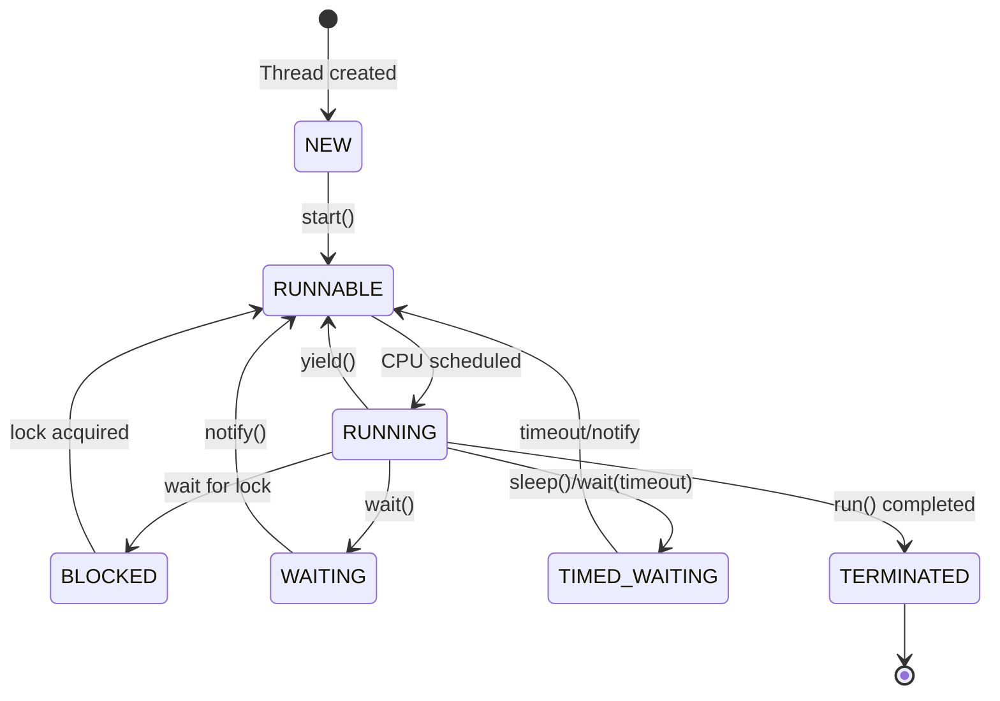

# Multithreading

Multithreading cho phép chương trình thực thi nhiều tác vụ đồng thời, tận dụng tối đa tài nguyên CPU.

## Khái niệm cơ bản

### Process vs Thread

| Process | Thread |
|---------|--------|
| Chương trình đang chạy | Đơn vị thực thi nhỏ nhất trong process |
| Có bộ nhớ riêng | Chia sẻ bộ nhớ với các thread khác |
| Nặng, tốn tài nguyên | Nhẹ, ít tốn tài nguyên |
| Giao tiếp phức tạp (IPC) | Giao tiếp dễ dàng qua shared memory |

### Thread States



---

## Tạo Thread

### Cách 1: Extends Thread

```java
public class MyThread extends Thread {
    private String name;
    
    public MyThread(String name) {
        this.name = name;
    }
    
    @Override
    public void run() {
        for (int i = 0; i < 5; i++) {
            System.out.println(name + ": " + i);
            try {
                Thread.sleep(100);
            } catch (InterruptedException e) {
                e.printStackTrace();
            }
        }
    }
}

// Sử dụng
MyThread t1 = new MyThread("Thread-1");
MyThread t2 = new MyThread("Thread-2");

t1.start();  // Bắt đầu thread
t2.start();

// KHÔNG gọi run() trực tiếp - sẽ chạy trên main thread
// t1.run();  // SAI!
```

### Cách 2: Implements Runnable (Khuyến nghị)

```java
public class MyRunnable implements Runnable {
    private String name;
    
    public MyRunnable(String name) {
        this.name = name;
    }
    
    @Override
    public void run() {
        for (int i = 0; i < 5; i++) {
            System.out.println(name + ": " + i);
        }
    }
}

// Sử dụng
Thread t1 = new Thread(new MyRunnable("Runnable-1"));
Thread t2 = new Thread(new MyRunnable("Runnable-2"));

t1.start();
t2.start();
```

### Cách 3: Lambda (Java 8+)

```java
Thread t1 = new Thread(() -> {
    for (int i = 0; i < 5; i++) {
        System.out.println("Lambda thread: " + i);
    }
});

t1.start();
```

### Cách 4: Implements Callable (có return value)

```java
import java.util.concurrent.Callable;
import java.util.concurrent.FutureTask;

public class MyCallable implements Callable<Integer> {
    @Override
    public Integer call() throws Exception {
        int sum = 0;
        for (int i = 1; i <= 100; i++) {
            sum += i;
        }
        return sum;
    }
}

// Sử dụng
FutureTask<Integer> futureTask = new FutureTask<>(new MyCallable());
Thread t = new Thread(futureTask);
t.start();

// Lấy kết quả (blocking)
Integer result = futureTask.get();
System.out.println("Sum: " + result);
```

---

## Thread Methods

```java
Thread t = new Thread(() -> {
    // task
});

// Các method quan trọng
t.start();              // Bắt đầu thread
t.join();               // Đợi thread kết thúc
t.join(1000);           // Đợi tối đa 1000ms
Thread.sleep(500);      // Tạm dừng 500ms
Thread.yield();         // Nhường CPU cho thread khác
t.interrupt();          // Gửi tín hiệu interrupt
t.isAlive();            // Kiểm tra thread còn chạy không
t.setName("MyThread");  // Đặt tên
t.setPriority(Thread.MAX_PRIORITY);  // Đặt priority (1-10)
t.setDaemon(true);      // Đặt làm daemon thread

// Static methods
Thread.currentThread(); // Lấy thread hiện tại
Thread.activeCount();   // Số thread đang active
```

### Join Example

```java
Thread t1 = new Thread(() -> {
    System.out.println("Task 1 started");
    try { Thread.sleep(2000); } catch (InterruptedException e) {}
    System.out.println("Task 1 completed");
});

Thread t2 = new Thread(() -> {
    System.out.println("Task 2 started");
    try { Thread.sleep(1000); } catch (InterruptedException e) {}
    System.out.println("Task 2 completed");
});

t1.start();
t2.start();

// Đợi cả 2 thread hoàn thành
t1.join();
t2.join();

System.out.println("All tasks completed");
```

---

## Synchronization

### Vấn đề Race Condition

```java
public class Counter {
    private int count = 0;
    
    public void increment() {
        count++;  // Không atomic! Read -> Modify -> Write
    }
    
    public int getCount() {
        return count;
    }
}

// Race condition
Counter counter = new Counter();
Thread t1 = new Thread(() -> {
    for (int i = 0; i < 10000; i++) counter.increment();
});
Thread t2 = new Thread(() -> {
    for (int i = 0; i < 10000; i++) counter.increment();
});

t1.start(); t2.start();
t1.join(); t2.join();

System.out.println(counter.getCount());  // Có thể < 20000!
```

### Synchronized Method

```java
public class Counter {
    private int count = 0;
    
    // Synchronized method - chỉ 1 thread được vào tại một thời điểm
    public synchronized void increment() {
        count++;
    }
    
    public synchronized int getCount() {
        return count;
    }
}
```

### Synchronized Block

```java
public class Counter {
    private int count = 0;
    private final Object lock = new Object();
    
    public void increment() {
        synchronized (lock) {
            count++;
        }
    }
    
    public void decrement() {
        synchronized (lock) {
            count--;
        }
    }
}
```

### Volatile

```java
public class SharedFlag {
    // volatile đảm bảo visibility giữa các thread
    private volatile boolean running = true;
    
    public void stop() {
        running = false;
    }
    
    public void run() {
        while (running) {
            // Do work
        }
    }
}
```

---

## Wait và Notify

### Producer-Consumer Pattern

```java
public class SharedBuffer {
    private Queue<Integer> buffer = new LinkedList<>();
    private int capacity = 5;
    
    public synchronized void produce(int item) throws InterruptedException {
        while (buffer.size() == capacity) {
            wait();  // Đợi khi buffer đầy
        }
        
        buffer.add(item);
        System.out.println("Produced: " + item);
        
        notifyAll();  // Thông báo cho consumer
    }
    
    public synchronized int consume() throws InterruptedException {
        while (buffer.isEmpty()) {
            wait();  // Đợi khi buffer rỗng
        }
        
        int item = buffer.poll();
        System.out.println("Consumed: " + item);
        
        notifyAll();  // Thông báo cho producer
        return item;
    }
}

// Producer
Thread producer = new Thread(() -> {
    for (int i = 0; i < 10; i++) {
        try {
            buffer.produce(i);
        } catch (InterruptedException e) {}
    }
});

// Consumer
Thread consumer = new Thread(() -> {
    for (int i = 0; i < 10; i++) {
        try {
            buffer.consume();
        } catch (InterruptedException e) {}
    }
});
```

---

## ExecutorService

### Thread Pool

```java
import java.util.concurrent.ExecutorService;
import java.util.concurrent.Executors;

// Fixed thread pool
ExecutorService executor = Executors.newFixedThreadPool(4);

// Submit tasks
for (int i = 0; i < 10; i++) {
    final int taskId = i;
    executor.submit(() -> {
        System.out.println("Task " + taskId + " running on " + 
            Thread.currentThread().getName());
    });
}

// Shutdown
executor.shutdown();  // Không nhận task mới, đợi task hiện tại hoàn thành
executor.awaitTermination(60, TimeUnit.SECONDS);
```

### Các loại Thread Pool

```java
// Fixed size - số thread cố định
ExecutorService fixed = Executors.newFixedThreadPool(4);

// Cached - tạo thread mới khi cần, reuse thread idle
ExecutorService cached = Executors.newCachedThreadPool();

// Single thread - chỉ 1 thread
ExecutorService single = Executors.newSingleThreadExecutor();

// Scheduled - chạy task theo lịch
ScheduledExecutorService scheduled = Executors.newScheduledThreadPool(2);

// Schedule task
scheduled.schedule(() -> System.out.println("Delayed task"), 
    5, TimeUnit.SECONDS);

scheduled.scheduleAtFixedRate(() -> System.out.println("Periodic task"), 
    0, 1, TimeUnit.SECONDS);
```

### Future

```java
ExecutorService executor = Executors.newFixedThreadPool(2);

// Submit Callable, nhận Future
Future<Integer> future = executor.submit(() -> {
    Thread.sleep(2000);
    return 42;
});

// Kiểm tra hoàn thành
boolean isDone = future.isDone();

// Lấy kết quả (blocking)
Integer result = future.get();

// Lấy kết quả với timeout
Integer result2 = future.get(3, TimeUnit.SECONDS);

// Hủy task
future.cancel(true);
```

---

## CompletableFuture (Java 8+)

```java
import java.util.concurrent.CompletableFuture;

// Tạo CompletableFuture
CompletableFuture<String> future = CompletableFuture.supplyAsync(() -> {
    // Chạy async
    return "Hello";
});

// Chain operations
CompletableFuture<String> result = future
    .thenApply(s -> s + " World")           // Transform
    .thenApply(String::toUpperCase);        // Transform tiếp

System.out.println(result.get());  // "HELLO WORLD"

// Combine futures
CompletableFuture<String> future1 = CompletableFuture.supplyAsync(() -> "Hello");
CompletableFuture<String> future2 = CompletableFuture.supplyAsync(() -> "World");

CompletableFuture<String> combined = future1
    .thenCombine(future2, (s1, s2) -> s1 + " " + s2);

// Handle exception
CompletableFuture<String> withError = CompletableFuture
    .supplyAsync(() -> {
        if (true) throw new RuntimeException("Error!");
        return "Success";
    })
    .exceptionally(ex -> "Default value");

// Run multiple futures
CompletableFuture<Void> allOf = CompletableFuture.allOf(future1, future2);
CompletableFuture<Object> anyOf = CompletableFuture.anyOf(future1, future2);
```

---

## Thread-safe Collections

```java
import java.util.concurrent.*;

// Thread-safe List
List<String> syncList = Collections.synchronizedList(new ArrayList<>());
CopyOnWriteArrayList<String> cowList = new CopyOnWriteArrayList<>();

// Thread-safe Set
Set<String> syncSet = Collections.synchronizedSet(new HashSet<>());
CopyOnWriteArraySet<String> cowSet = new CopyOnWriteArraySet<>();

// Thread-safe Map
Map<String, Integer> syncMap = Collections.synchronizedMap(new HashMap<>());
ConcurrentHashMap<String, Integer> concurrentMap = new ConcurrentHashMap<>();

// Thread-safe Queue
BlockingQueue<String> blockingQueue = new LinkedBlockingQueue<>();
ConcurrentLinkedQueue<String> concurrentQueue = new ConcurrentLinkedQueue<>();
```

---

## Best Practices

1. **Ưu tiên Runnable/Callable** hơn extends Thread
2. **Sử dụng ExecutorService** thay vì tạo Thread thủ công
3. **Tránh synchronized quá nhiều** - gây bottleneck
4. **Sử dụng concurrent collections** thay vì synchronized collections
5. **Luôn shutdown ExecutorService** khi không dùng nữa
6. **Xử lý InterruptedException** đúng cách
7. **Tránh deadlock** - lock theo thứ tự nhất quán

---

## Bài tập thực hành

!!! example "Bài tập"
    Viết chương trình download nhiều file đồng thời:
    
    1. Sử dụng ExecutorService với fixed thread pool (4 threads)
    2. Mỗi task download 1 file (giả lập bằng Thread.sleep)
    3. Hiển thị progress và thời gian hoàn thành

## Tiếp theo

- [Java 8+ Features](java8-features.md)
