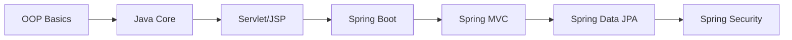

# Java

Java là một ngôn ngữ lập trình hướng đối tượng, được sử dụng rộng rãi trong phát triển ứng dụng enterprise, web, mobile và nhiều lĩnh vực khác.

## Tại sao học Java?

- **Phổ biến**: Java là một trong những ngôn ngữ được sử dụng nhiều nhất trên thế giới
- **Đa nền tảng**: "Write Once, Run Anywhere" - code Java chạy được trên mọi hệ điều hành
- **Cộng đồng lớn**: Nhiều tài liệu, thư viện và framework hỗ trợ
- **Cơ hội việc làm**: Nhu cầu tuyển dụng Java developer luôn cao

## Nội dung học tập

### 1. OOP - Lập trình hướng đối tượng

Nền tảng quan trọng nhất của Java:

- [Tổng quan OOP](oop/index.md)
- [4 tính chất OOP](oop/4-tinh-chat.md)
- [Abstract Class & Interface](oop/abstract-interface.md)
- [SOLID Principles](oop/solid.md)

### 2. Java Core

Các kiến thức cốt lõi của Java:

- [Collections Framework](core/collections.md)
- [Exception Handling](core/exception.md)
- [Multithreading](core/multithreading.md)
- [Java 8+ Features](core/java8-features.md)

### 3. Servlet & JSP

Lập trình web với Java:

- [Servlet cơ bản](web/servlet.md)
- [JSP cơ bản](web/jsp.md)
- [MVC Pattern](web/mvc.md)

### 4. Spring Framework

Framework phổ biến nhất cho Java:

- [Spring Boot cơ bản](spring/springboot-basic.md)
- [Spring MVC](spring/spring-mvc.md)
- [Spring Data JPA](spring/spring-data-jpa.md)
- [Spring Security](spring/spring-security.md)

### 5. Best Practices

- [Các best practices trong Java](best-practice.md)

## Lộ trình học

## Yêu cầu

- JDK 17 hoặc cao hơn
- IDE: IntelliJ IDEA (khuyến nghị) hoặc Eclipse
- Maven hoặc Gradle

!!! tip "Mẹo"
    Hãy thực hành code song song với việc đọc lý thuyết. Đừng chỉ đọc mà không code!
