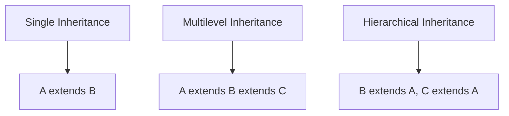

# 4 Tính chất của OOP

Lập trình hướng đối tượng có 4 tính chất cơ bản: **Encapsulation**, **Inheritance**, **Polymorphism** và **Abstraction**.

## 1. Encapsulation (Đóng gói)

### Khái niệm

**Encapsulation** là việc đóng gói dữ liệu (thuộc tính) và các phương thức xử lý dữ liệu vào trong một class, đồng thời kiểm soát quyền truy cập vào dữ liệu đó.

### Cách thực hiện

- Khai báo thuộc tính là `private`
- Cung cấp `getter` và `setter` để truy cập/thay đổi giá trị

```java
public class Employee {
    // Private fields - không thể truy cập trực tiếp từ bên ngoài
    private String name;
    private double salary;
    private int age;
    
    // Constructor
    public Employee(String name, double salary, int age) {
        this.name = name;
        setSalary(salary);  // Sử dụng setter để validate
        setAge(age);
    }
    
    // Getter
    public String getName() {
        return name;
    }
    
    // Setter với validation
    public void setName(String name) {
        if (name != null && !name.trim().isEmpty()) {
            this.name = name;
        }
    }
    
    public double getSalary() {
        return salary;
    }
    
    public void setSalary(double salary) {
        if (salary >= 0) {
            this.salary = salary;
        }
    }
    
    public int getAge() {
        return age;
    }
    
    public void setAge(int age) {
        if (age >= 18 && age <= 65) {
            this.age = age;
        }
    }
}
```

### Lợi ích

| Lợi ích | Mô tả |
|---------|-------|
| **Bảo vệ dữ liệu** | Ngăn chặn truy cập trái phép |
| **Validation** | Kiểm tra dữ liệu trước khi gán |
| **Flexibility** | Có thể thay đổi implementation mà không ảnh hưởng code bên ngoài |
| **Maintainability** | Dễ bảo trì và debug |

### Access Modifiers

| Modifier | Class | Package | Subclass | World |
|----------|-------|---------|----------|-------|
| `public` | Yes | Yes | Yes | Yes |
| `protected` | Yes | Yes | Yes | No |
| `default` | Yes | Yes | No | No |
| `private` | Yes | No | No | No |

---

## 2. Inheritance (Kế thừa)

### Khái niệm

**Inheritance** cho phép một class (class con) kế thừa các thuộc tính và phương thức từ class khác (class cha).

### Cú pháp

```java
// Class cha (Parent/Super class)
public class Animal {
    protected String name;
    protected int age;
    
    public Animal(String name, int age) {
        this.name = name;
        this.age = age;
    }
    
    public void eat() {
        System.out.println(name + " đang ăn");
    }
    
    public void sleep() {
        System.out.println(name + " đang ngủ");
    }
}

// Class con (Child/Sub class)
public class Dog extends Animal {
    private String breed;
    
    public Dog(String name, int age, String breed) {
        super(name, age);  // Gọi constructor của class cha
        this.breed = breed;
    }
    
    // Phương thức riêng của Dog
    public void bark() {
        System.out.println(name + " đang sủa: Gâu gâu!");
    }
    
    // Override phương thức của class cha
    @Override
    public void eat() {
        System.out.println(name + " đang ăn xương");
    }
}

// Class con khác
public class Cat extends Animal {
    public Cat(String name, int age) {
        super(name, age);
    }
    
    public void meow() {
        System.out.println(name + " đang kêu: Meo meo!");
    }
}
```

### Sử dụng

```java
Dog myDog = new Dog("Buddy", 3, "Golden Retriever");
myDog.eat();    // "Buddy đang ăn xương" (overridden)
myDog.sleep();  // "Buddy đang ngủ" (inherited)
myDog.bark();   // "Buddy đang sủa: Gâu gâu!" (own method)
```

### Các loại kế thừa



!!! warning "Lưu ý"
    Java **không hỗ trợ** Multiple Inheritance với class (một class không thể extends nhiều class). Tuy nhiên, có thể implements nhiều interface.

---

## 3. Polymorphism (Đa hình)

### Khái niệm

**Polymorphism** cho phép một đối tượng có thể có nhiều hình thái khác nhau. Cùng một phương thức có thể hoạt động khác nhau tùy thuộc vào đối tượng gọi nó.

### Compile-time Polymorphism (Method Overloading)

Cùng tên phương thức nhưng khác tham số:

```java
public class Calculator {
    // Overloading - cùng tên, khác tham số
    public int add(int a, int b) {
        return a + b;
    }
    
    public int add(int a, int b, int c) {
        return a + b + c;
    }
    
    public double add(double a, double b) {
        return a + b;
    }
    
    public String add(String a, String b) {
        return a + b;
    }
}

// Sử dụng
Calculator calc = new Calculator();
calc.add(1, 2);           // Gọi add(int, int) -> 3
calc.add(1, 2, 3);        // Gọi add(int, int, int) -> 6
calc.add(1.5, 2.5);       // Gọi add(double, double) -> 4.0
calc.add("Hello", "World"); // Gọi add(String, String) -> "HelloWorld"
```

### Runtime Polymorphism (Method Overriding)

Class con ghi đè phương thức của class cha:

```java
public class Shape {
    public double calculateArea() {
        return 0;
    }
}

public class Rectangle extends Shape {
    private double width;
    private double height;
    
    public Rectangle(double width, double height) {
        this.width = width;
        this.height = height;
    }
    
    @Override
    public double calculateArea() {
        return width * height;
    }
}

public class Circle extends Shape {
    private double radius;
    
    public Circle(double radius) {
        this.radius = radius;
    }
    
    @Override
    public double calculateArea() {
        return Math.PI * radius * radius;
    }
}
```

### Sử dụng Polymorphism

```java
// Polymorphism cho phép sử dụng reference của class cha
Shape shape1 = new Rectangle(5, 3);
Shape shape2 = new Circle(4);

// Cùng phương thức nhưng kết quả khác nhau
System.out.println(shape1.calculateArea()); // 15.0
System.out.println(shape2.calculateArea()); // 50.26...

// Có thể dùng trong collection
List<Shape> shapes = new ArrayList<>();
shapes.add(new Rectangle(5, 3));
shapes.add(new Circle(4));
shapes.add(new Rectangle(2, 2));

for (Shape shape : shapes) {
    System.out.println("Diện tích: " + shape.calculateArea());
}
```

---

## 4. Abstraction (Trừu tượng)

### Khái niệm

**Abstraction** là việc ẩn đi các chi tiết implementation phức tạp và chỉ hiển thị những tính năng cần thiết cho người dùng.

### Abstract Class

```java
// Abstract class - không thể tạo instance trực tiếp
public abstract class Vehicle {
    protected String brand;
    protected int year;
    
    public Vehicle(String brand, int year) {
        this.brand = brand;
        this.year = year;
    }
    
    // Abstract method - không có body, bắt buộc class con phải implement
    public abstract void start();
    public abstract void stop();
    
    // Concrete method - có body, class con có thể sử dụng hoặc override
    public void displayInfo() {
        System.out.println("Brand: " + brand + ", Year: " + year);
    }
}

// Concrete class
public class Car extends Vehicle {
    private int numberOfDoors;
    
    public Car(String brand, int year, int numberOfDoors) {
        super(brand, year);
        this.numberOfDoors = numberOfDoors;
    }
    
    @Override
    public void start() {
        System.out.println("Xe hơi " + brand + " khởi động bằng chìa khóa");
    }
    
    @Override
    public void stop() {
        System.out.println("Xe hơi " + brand + " dừng lại");
    }
}

public class Motorcycle extends Vehicle {
    public Motorcycle(String brand, int year) {
        super(brand, year);
    }
    
    @Override
    public void start() {
        System.out.println("Xe máy " + brand + " khởi động bằng đề");
    }
    
    @Override
    public void stop() {
        System.out.println("Xe máy " + brand + " dừng lại");
    }
}
```

### Interface

```java
// Interface - 100% abstract (trước Java 8)
public interface Drawable {
    void draw();  // Mặc định là public abstract
    
    // Java 8+: có thể có default method
    default void print() {
        System.out.println("Printing...");
    }
    
    // Java 8+: có thể có static method
    static void info() {
        System.out.println("This is Drawable interface");
    }
}

public interface Colorable {
    void setColor(String color);
    String getColor();
}

// Class có thể implement nhiều interface
public class Square implements Drawable, Colorable {
    private String color;
    private int side;
    
    @Override
    public void draw() {
        System.out.println("Vẽ hình vuông màu " + color);
    }
    
    @Override
    public void setColor(String color) {
        this.color = color;
    }
    
    @Override
    public String getColor() {
        return color;
    }
}
```

---

## So sánh 4 tính chất

| Tính chất | Mục đích | Cách thực hiện |
|-----------|----------|----------------|
| **Encapsulation** | Bảo vệ dữ liệu | private + getter/setter |
| **Inheritance** | Tái sử dụng code | extends |
| **Polymorphism** | Linh hoạt | Overloading/Overriding |
| **Abstraction** | Ẩn chi tiết | abstract class/interface |

## Bài tập thực hành

!!! example "Bài tập"
    Tạo hệ thống quản lý nhân viên với:
    
    1. Abstract class `Employee` với thuộc tính: id, name, baseSalary
    2. Abstract method: `calculateSalary()`
    3. Class `FullTimeEmployee` với bonus
    4. Class `PartTimeEmployee` với hoursWorked và hourlyRate
    5. Mỗi class implement `calculateSalary()` theo cách riêng

## Tiếp theo

- [Abstract Class & Interface chi tiết](abstract-interface.md)
- [SOLID Principles](solid.md)
