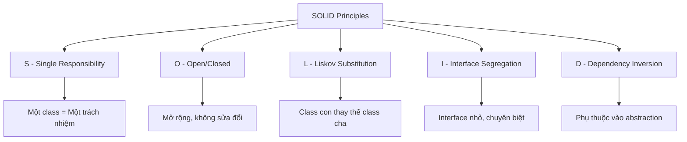

# SOLID Principles

SOLID là 5 nguyên tắc thiết kế hướng đối tượng giúp code dễ bảo trì, mở rộng và tái sử dụng.

## Tổng quan

| Chữ cái | Nguyên tắc | Ý nghĩa |
|---------|------------|---------|
| **S** | Single Responsibility | Một class chỉ nên có một lý do để thay đổi |
| **O** | Open/Closed | Mở cho mở rộng, đóng cho sửa đổi |
| **L** | Liskov Substitution | Class con có thể thay thế class cha |
| **I** | Interface Segregation | Nhiều interface nhỏ tốt hơn một interface lớn |
| **D** | Dependency Inversion | Phụ thuộc vào abstraction, không phụ thuộc vào implementation |

---

## S - Single Responsibility Principle (SRP)

### Nguyên tắc

> Một class chỉ nên có **một lý do duy nhất** để thay đổi.

### Vi phạm SRP

```java
// BAD: Class làm quá nhiều việc
public class Employee {
    private String name;
    private double salary;
    
    public void calculateSalary() {
        // Tính lương
    }
    
    public void saveToDatabase() {
        // Lưu vào database - không nên ở đây!
    }
    
    public void generateReport() {
        // Tạo báo cáo - không nên ở đây!
    }
    
    public void sendEmail() {
        // Gửi email - không nên ở đây!
    }
}
```

### Tuân thủ SRP

```java
// GOOD: Mỗi class một trách nhiệm
public class Employee {
    private String name;
    private double salary;
    
    // Chỉ chứa logic liên quan đến Employee
    public double calculateSalary() {
        return salary;
    }
}

public class EmployeeRepository {
    public void save(Employee employee) {
        // Lưu vào database
    }
    
    public Employee findById(Long id) {
        // Tìm employee
        return null;
    }
}

public class EmployeeReportGenerator {
    public String generateReport(Employee employee) {
        // Tạo báo cáo
        return "";
    }
}

public class EmailService {
    public void sendEmail(String to, String subject, String body) {
        // Gửi email
    }
}
```

---

## O - Open/Closed Principle (OCP)

### Nguyên tắc

> Class nên **mở cho việc mở rộng** nhưng **đóng cho việc sửa đổi**.

### Vi phạm OCP

```java
// BAD: Phải sửa code khi thêm loại discount mới
public class DiscountCalculator {
    public double calculateDiscount(String customerType, double amount) {
        if (customerType.equals("REGULAR")) {
            return amount * 0.1;
        } else if (customerType.equals("VIP")) {
            return amount * 0.2;
        } else if (customerType.equals("PREMIUM")) {
            return amount * 0.3;
        }
        // Thêm loại mới = sửa code ở đây
        return 0;
    }
}
```

### Tuân thủ OCP

```java
// GOOD: Mở rộng bằng cách thêm class mới
public interface DiscountStrategy {
    double calculateDiscount(double amount);
}

public class RegularDiscount implements DiscountStrategy {
    @Override
    public double calculateDiscount(double amount) {
        return amount * 0.1;
    }
}

public class VIPDiscount implements DiscountStrategy {
    @Override
    public double calculateDiscount(double amount) {
        return amount * 0.2;
    }
}

public class PremiumDiscount implements DiscountStrategy {
    @Override
    public double calculateDiscount(double amount) {
        return amount * 0.3;
    }
}

// Thêm loại mới chỉ cần tạo class mới
public class StudentDiscount implements DiscountStrategy {
    @Override
    public double calculateDiscount(double amount) {
        return amount * 0.15;
    }
}

// Calculator không cần sửa đổi
public class DiscountCalculator {
    public double calculate(DiscountStrategy strategy, double amount) {
        return strategy.calculateDiscount(amount);
    }
}
```

---

## L - Liskov Substitution Principle (LSP)

### Nguyên tắc

> Class con phải có thể **thay thế** class cha mà không làm thay đổi tính đúng đắn của chương trình.

### Vi phạm LSP

```java
// BAD: Square không thể thay thế Rectangle
public class Rectangle {
    protected int width;
    protected int height;
    
    public void setWidth(int width) {
        this.width = width;
    }
    
    public void setHeight(int height) {
        this.height = height;
    }
    
    public int getArea() {
        return width * height;
    }
}

public class Square extends Rectangle {
    // Vi phạm LSP: Square thay đổi behavior của setWidth/setHeight
    @Override
    public void setWidth(int width) {
        this.width = width;
        this.height = width;  // Bắt buộc width = height
    }
    
    @Override
    public void setHeight(int height) {
        this.width = height;
        this.height = height;
    }
}

// Test thất bại
public void testArea(Rectangle rect) {
    rect.setWidth(5);
    rect.setHeight(4);
    // Expect: 20, nhưng nếu rect là Square thì = 16
    assert rect.getArea() == 20;  // FAIL với Square!
}
```

### Tuân thủ LSP

```java
// GOOD: Sử dụng interface chung
public interface Shape {
    int getArea();
}

public class Rectangle implements Shape {
    private int width;
    private int height;
    
    public Rectangle(int width, int height) {
        this.width = width;
        this.height = height;
    }
    
    @Override
    public int getArea() {
        return width * height;
    }
}

public class Square implements Shape {
    private int side;
    
    public Square(int side) {
        this.side = side;
    }
    
    @Override
    public int getArea() {
        return side * side;
    }
}
```

---

## I - Interface Segregation Principle (ISP)

### Nguyên tắc

> Client không nên bị buộc phụ thuộc vào các method mà nó không sử dụng. **Nhiều interface nhỏ** tốt hơn một interface lớn.

### Vi phạm ISP

```java
// BAD: Interface quá lớn
public interface Worker {
    void work();
    void eat();
    void sleep();
    void code();
    void attendMeeting();
    void writeReport();
}

// Robot không cần eat() và sleep()
public class Robot implements Worker {
    @Override
    public void work() { /* OK */ }
    
    @Override
    public void eat() { 
        // Robot không ăn - bắt buộc implement rỗng!
    }
    
    @Override
    public void sleep() {
        // Robot không ngủ - bắt buộc implement rỗng!
    }
    
    @Override
    public void code() { /* OK */ }
    
    @Override
    public void attendMeeting() { /* OK */ }
    
    @Override
    public void writeReport() { /* OK */ }
}
```

### Tuân thủ ISP

```java
// GOOD: Chia thành nhiều interface nhỏ
public interface Workable {
    void work();
}

public interface Eatable {
    void eat();
}

public interface Sleepable {
    void sleep();
}

public interface Codeable {
    void code();
}

// Human implement tất cả
public class Human implements Workable, Eatable, Sleepable, Codeable {
    @Override
    public void work() { /* ... */ }
    
    @Override
    public void eat() { /* ... */ }
    
    @Override
    public void sleep() { /* ... */ }
    
    @Override
    public void code() { /* ... */ }
}

// Robot chỉ implement những gì cần
public class Robot implements Workable, Codeable {
    @Override
    public void work() { /* ... */ }
    
    @Override
    public void code() { /* ... */ }
}
```

---

## D - Dependency Inversion Principle (DIP)

### Nguyên tắc

> 1. Module cấp cao không nên phụ thuộc vào module cấp thấp. Cả hai nên phụ thuộc vào **abstraction**.
> 2. Abstraction không nên phụ thuộc vào chi tiết. Chi tiết nên phụ thuộc vào abstraction.

### Vi phạm DIP

```java
// BAD: High-level module phụ thuộc trực tiếp vào low-level module
public class MySQLDatabase {
    public void save(String data) {
        System.out.println("Saving to MySQL: " + data);
    }
}

public class UserService {
    // Phụ thuộc trực tiếp vào MySQLDatabase
    private MySQLDatabase database = new MySQLDatabase();
    
    public void saveUser(String user) {
        database.save(user);
    }
}

// Muốn đổi sang PostgreSQL? Phải sửa UserService!
```

### Tuân thủ DIP

```java
// GOOD: Phụ thuộc vào abstraction
public interface Database {
    void save(String data);
    String find(String id);
}

public class MySQLDatabase implements Database {
    @Override
    public void save(String data) {
        System.out.println("Saving to MySQL: " + data);
    }
    
    @Override
    public String find(String id) {
        return "Data from MySQL";
    }
}

public class PostgreSQLDatabase implements Database {
    @Override
    public void save(String data) {
        System.out.println("Saving to PostgreSQL: " + data);
    }
    
    @Override
    public String find(String id) {
        return "Data from PostgreSQL";
    }
}

public class UserService {
    // Phụ thuộc vào abstraction (interface)
    private Database database;
    
    // Dependency Injection qua constructor
    public UserService(Database database) {
        this.database = database;
    }
    
    public void saveUser(String user) {
        database.save(user);
    }
}

// Sử dụng
Database mysql = new MySQLDatabase();
UserService userService1 = new UserService(mysql);

Database postgres = new PostgreSQLDatabase();
UserService userService2 = new UserService(postgres);
```

---

## Tổng kết



## Bài tập thực hành

!!! example "Bài tập"
    Refactor đoạn code sau để tuân thủ SOLID:
    
    ```java
    public class OrderProcessor {
        public void processOrder(Order order) {
            // Validate order
            if (order.getItems().isEmpty()) {
                throw new RuntimeException("Empty order");
            }
            
            // Calculate total
            double total = 0;
            for (Item item : order.getItems()) {
                total += item.getPrice();
            }
            
            // Apply discount
            if (order.getCustomerType().equals("VIP")) {
                total *= 0.8;
            }
            
            // Save to database
            Connection conn = DriverManager.getConnection("...");
            // ...
            
            // Send email
            // ...
            
            // Print invoice
            // ...
        }
    }
    ```

## Tiếp theo

- [Collections Framework](../core/collections.md)
