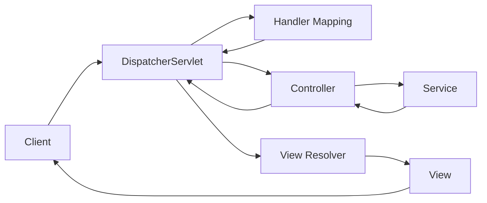

# Spring MVC

Spring MVC là một module của Spring Framework để xây dựng ứng dụng web theo mô hình Model-View-Controller.

## Tổng quan

### Kiến trúc Spring MVC



### Luồng xử lý Request

1. Client gửi request đến **DispatcherServlet**
2. DispatcherServlet tìm **Handler Mapping** phù hợp
3. Handler Mapping trả về **Controller**
4. Controller xử lý request, gọi **Service**
5. Controller trả về **ModelAndView**
6. **View Resolver** tìm View tương ứng
7. View render response và trả về Client

---

## Controller

### @Controller vs @RestController

```java
// @Controller - trả về view name
@Controller
public class HomeController {
    
    @GetMapping("/")
    public String home(Model model) {
        model.addAttribute("message", "Welcome!");
        return "home";  // Trả về view name: home.html
    }
}

// @RestController = @Controller + @ResponseBody
@RestController
@RequestMapping("/api")
public class ApiController {
    
    @GetMapping("/data")
    public Map<String, Object> getData() {
        return Map.of("status", "ok");  // Trả về JSON
    }
}
```

### Request Mapping

```java
@Controller
@RequestMapping("/products")
public class ProductController {
    
    // GET /products
    @GetMapping
    public String list(Model model) {
        model.addAttribute("products", productService.findAll());
        return "product/list";
    }
    
    // GET /products/123
    @GetMapping("/{id}")
    public String detail(@PathVariable Long id, Model model) {
        model.addAttribute("product", productService.findById(id));
        return "product/detail";
    }
    
    // GET /products/new
    @GetMapping("/new")
    public String showForm(Model model) {
        model.addAttribute("product", new Product());
        return "product/form";
    }
    
    // POST /products
    @PostMapping
    public String create(@Valid @ModelAttribute Product product,
                         BindingResult result,
                         RedirectAttributes redirectAttributes) {
        if (result.hasErrors()) {
            return "product/form";
        }
        
        productService.save(product);
        redirectAttributes.addFlashAttribute("message", "Product created!");
        return "redirect:/products";
    }
    
    // GET /products/123/edit
    @GetMapping("/{id}/edit")
    public String showEditForm(@PathVariable Long id, Model model) {
        model.addAttribute("product", productService.findById(id));
        return "product/form";
    }
    
    // PUT /products/123
    @PutMapping("/{id}")
    public String update(@PathVariable Long id,
                         @Valid @ModelAttribute Product product,
                         BindingResult result,
                         RedirectAttributes redirectAttributes) {
        if (result.hasErrors()) {
            return "product/form";
        }
        
        productService.update(id, product);
        redirectAttributes.addFlashAttribute("message", "Product updated!");
        return "redirect:/products";
    }
    
    // DELETE /products/123
    @DeleteMapping("/{id}")
    public String delete(@PathVariable Long id,
                         RedirectAttributes redirectAttributes) {
        productService.delete(id);
        redirectAttributes.addFlashAttribute("message", "Product deleted!");
        return "redirect:/products";
    }
}
```

---

## Model và View

### Truyền data đến View

```java
@Controller
public class DemoController {
    
    // Cách 1: Model
    @GetMapping("/demo1")
    public String demo1(Model model) {
        model.addAttribute("name", "John");
        model.addAttribute("age", 25);
        return "demo";
    }
    
    // Cách 2: ModelMap
    @GetMapping("/demo2")
    public String demo2(ModelMap model) {
        model.addAttribute("name", "John");
        return "demo";
    }
    
    // Cách 3: ModelAndView
    @GetMapping("/demo3")
    public ModelAndView demo3() {
        ModelAndView mav = new ModelAndView("demo");
        mav.addObject("name", "John");
        return mav;
    }
    
    // Cách 4: Map
    @GetMapping("/demo4")
    public String demo4(Map<String, Object> model) {
        model.put("name", "John");
        return "demo";
    }
}
```

### @ModelAttribute

```java
@Controller
@RequestMapping("/orders")
public class OrderController {
    
    // Được gọi trước mỗi request handler trong controller này
    @ModelAttribute("categories")
    public List<Category> populateCategories() {
        return categoryService.findAll();
    }
    
    @ModelAttribute("currentUser")
    public User populateUser(HttpSession session) {
        return (User) session.getAttribute("user");
    }
    
    @GetMapping("/new")
    public String showForm(@ModelAttribute("order") Order order) {
        // order đã được tạo tự động
        // categories và currentUser cũng có sẵn trong model
        return "order/form";
    }
    
    @PostMapping
    public String create(@ModelAttribute("order") Order order) {
        orderService.save(order);
        return "redirect:/orders";
    }
}
```

---

## Thymeleaf Template

### Cấu hình

```yaml
# application.yml
spring:
  thymeleaf:
    prefix: classpath:/templates/
    suffix: .html
    cache: false  # Tắt cache khi development
```

### Cú pháp cơ bản

```html
<!DOCTYPE html>
<html xmlns:th="http://www.thymeleaf.org">
<head>
    <title th:text="${pageTitle}">Default Title</title>
</head>
<body>
    <!-- Text -->
    <p th:text="${message}">Default message</p>
    <p th:utext="${htmlContent}">HTML content (unescaped)</p>
    
    <!-- Attributes -->
    <a th:href="@{/products/{id}(id=${product.id})}">View</a>
    
    <input th:value="${user.name}" />
    <div th:class="${isActive} ? 'active' : 'inactive'">...</div>
    
    <!-- Conditionals -->
    <div th:if="${user != null}">
        Welcome, <span th:text="${user.name}">User</span>
    </div>
    <div th:unless="${user != null}">
        Please login
    </div>
    
    <!-- Switch -->
    <div th:switch="${user.role}">
        <p th:case="'ADMIN'">Admin user</p>
        <p th:case="'USER'">Normal user</p>
        <p th:case="*">Guest</p>
    </div>
    
    <!-- Iteration -->
    <table>
        <tr th:each="product, stat : ${products}">
            <td th:text="${stat.index}">0</td>
            <td th:text="${product.name}">Name</td>
            <td th:text="${product.price}">0</td>
        </tr>
    </table>
    
    <!-- Forms -->
    <form th:action="@{/products}" th:object="${product}" method="post">
        <input type="text" th:field="*{name}" />
        <span th:if="${#fields.hasErrors('name')}" 
              th:errors="*{name}">Error</span>
        
        <input type="number" th:field="*{price}" />
        
        <select th:field="*{categoryId}">
            <option th:each="cat : ${categories}"
                    th:value="${cat.id}"
                    th:text="${cat.name}">Category</option>
        </select>
        
        <button type="submit">Save</button>
    </form>
    
    <!-- Fragments -->
    <div th:replace="~{fragments/header :: header}"></div>
    <div th:insert="~{fragments/footer :: footer}"></div>
</body>
</html>
```

### Layout với Fragments

**fragments/layout.html**
```html
<!DOCTYPE html>
<html xmlns:th="http://www.thymeleaf.org">
<head>
    <meta charset="UTF-8">
    <title th:text="${pageTitle}">My App</title>
    <link rel="stylesheet" th:href="@{/css/style.css}">
</head>
<body>
    <header th:fragment="header">
        <nav>
            <a th:href="@{/}">Home</a>
            <a th:href="@{/products}">Products</a>
        </nav>
    </header>
    
    <main th:fragment="content">
        <!-- Content will be replaced -->
    </main>
    
    <footer th:fragment="footer">
        <p>&copy; 2024 My App</p>
    </footer>
    
    <script th:src="@{/js/app.js}"></script>
</body>
</html>
```

**products/list.html**
```html
<!DOCTYPE html>
<html xmlns:th="http://www.thymeleaf.org"
      th:replace="~{fragments/layout :: html}">
<head>
    <title>Products</title>
</head>
<body>
    <div th:replace="~{fragments/layout :: header}"></div>
    
    <main>
        <h1>Product List</h1>
        
        <div th:if="${message}" class="alert alert-success" 
             th:text="${message}"></div>
        
        <table>
            <thead>
                <tr>
                    <th>ID</th>
                    <th>Name</th>
                    <th>Price</th>
                    <th>Actions</th>
                </tr>
            </thead>
            <tbody>
                <tr th:each="product : ${products}">
                    <td th:text="${product.id}">1</td>
                    <td th:text="${product.name}">Product</td>
                    <td th:text="${#numbers.formatCurrency(product.price)}">$0</td>
                    <td>
                        <a th:href="@{/products/{id}/edit(id=${product.id})}">Edit</a>
                        <form th:action="@{/products/{id}(id=${product.id})}" 
                              method="post" style="display:inline">
                            <input type="hidden" name="_method" value="DELETE">
                            <button type="submit" 
                                    onclick="return confirm('Are you sure?')">Delete</button>
                        </form>
                    </td>
                </tr>
            </tbody>
        </table>
        
        <a th:href="@{/products/new}" class="btn">Add New Product</a>
    </main>
    
    <div th:replace="~{fragments/layout :: footer}"></div>
</body>
</html>
```

---

## Form Handling

### Form với Validation

**Entity**
```java
@Data
public class ProductForm {
    
    private Long id;
    
    @NotBlank(message = "Name is required")
    @Size(min = 2, max = 100)
    private String name;
    
    @NotNull(message = "Price is required")
    @Positive(message = "Price must be positive")
    private BigDecimal price;
    
    @Min(0)
    private Integer stock = 0;
    
    private Long categoryId;
}
```

**Controller**
```java
@Controller
@RequestMapping("/products")
public class ProductController {
    
    @GetMapping("/new")
    public String showForm(Model model) {
        model.addAttribute("productForm", new ProductForm());
        model.addAttribute("categories", categoryService.findAll());
        return "product/form";
    }
    
    @PostMapping
    public String create(@Valid @ModelAttribute("productForm") ProductForm form,
                         BindingResult result,
                         Model model,
                         RedirectAttributes redirectAttributes) {
        
        // Custom validation
        if (productService.existsByName(form.getName())) {
            result.rejectValue("name", "duplicate", "Product name already exists");
        }
        
        if (result.hasErrors()) {
            model.addAttribute("categories", categoryService.findAll());
            return "product/form";
        }
        
        Product product = convertToEntity(form);
        productService.save(product);
        
        redirectAttributes.addFlashAttribute("message", "Product created successfully!");
        return "redirect:/products";
    }
}
```

**Form Template**
```html
<form th:action="@{/products}" th:object="${productForm}" method="post">
    <input type="hidden" th:field="*{id}" />
    
    <div class="form-group">
        <label for="name">Name</label>
        <input type="text" id="name" th:field="*{name}" 
               th:classappend="${#fields.hasErrors('name')} ? 'is-invalid'" />
        <div th:if="${#fields.hasErrors('name')}" class="error"
             th:errors="*{name}">Error</div>
    </div>
    
    <div class="form-group">
        <label for="price">Price</label>
        <input type="number" id="price" th:field="*{price}" step="0.01" />
        <div th:if="${#fields.hasErrors('price')}" class="error"
             th:errors="*{price}">Error</div>
    </div>
    
    <div class="form-group">
        <label for="stock">Stock</label>
        <input type="number" id="stock" th:field="*{stock}" />
    </div>
    
    <div class="form-group">
        <label for="categoryId">Category</label>
        <select id="categoryId" th:field="*{categoryId}">
            <option value="">-- Select --</option>
            <option th:each="cat : ${categories}"
                    th:value="${cat.id}"
                    th:text="${cat.name}">Category</option>
        </select>
    </div>
    
    <button type="submit">Save</button>
    <a th:href="@{/products}">Cancel</a>
</form>
```

---

## Interceptors

```java
@Component
public class LoggingInterceptor implements HandlerInterceptor {
    
    private static final Logger log = LoggerFactory.getLogger(LoggingInterceptor.class);
    
    @Override
    public boolean preHandle(HttpServletRequest request, 
                             HttpServletResponse response, 
                             Object handler) {
        log.info("Request: {} {}", request.getMethod(), request.getRequestURI());
        request.setAttribute("startTime", System.currentTimeMillis());
        return true;  // true = continue, false = stop
    }
    
    @Override
    public void postHandle(HttpServletRequest request, 
                           HttpServletResponse response, 
                           Object handler, 
                           ModelAndView modelAndView) {
        // Sau khi controller xử lý, trước khi render view
    }
    
    @Override
    public void afterCompletion(HttpServletRequest request, 
                                HttpServletResponse response, 
                                Object handler, 
                                Exception ex) {
        long startTime = (Long) request.getAttribute("startTime");
        long duration = System.currentTimeMillis() - startTime;
        log.info("Response: {} - {}ms", response.getStatus(), duration);
    }
}

@Configuration
public class WebConfig implements WebMvcConfigurer {
    
    @Autowired
    private LoggingInterceptor loggingInterceptor;
    
    @Override
    public void addInterceptors(InterceptorRegistry registry) {
        registry.addInterceptor(loggingInterceptor)
                .addPathPatterns("/**")
                .excludePathPatterns("/static/**", "/css/**", "/js/**");
    }
}
```

---

## File Upload

```java
@Controller
@RequestMapping("/files")
public class FileController {
    
    @Value("${upload.path}")
    private String uploadPath;
    
    @PostMapping("/upload")
    public String upload(@RequestParam("file") MultipartFile file,
                         RedirectAttributes redirectAttributes) {
        
        if (file.isEmpty()) {
            redirectAttributes.addFlashAttribute("error", "Please select a file");
            return "redirect:/files";
        }
        
        try {
            String filename = UUID.randomUUID() + "_" + file.getOriginalFilename();
            Path path = Paths.get(uploadPath, filename);
            Files.copy(file.getInputStream(), path);
            
            redirectAttributes.addFlashAttribute("message", "File uploaded: " + filename);
        } catch (IOException e) {
            redirectAttributes.addFlashAttribute("error", "Upload failed");
        }
        
        return "redirect:/files";
    }
}
```

```yaml
# application.yml
spring:
  servlet:
    multipart:
      max-file-size: 10MB
      max-request-size: 10MB

upload:
  path: /var/uploads
```

---

## Bài tập thực hành

!!! example "Bài tập"
    Xây dựng ứng dụng quản lý nhân viên với:
    
    1. CRUD với Thymeleaf
    2. Form validation
    3. File upload (avatar)
    4. Pagination
    5. Search/Filter

## Tiếp theo

- [Spring Data JPA](spring-data-jpa.md)
