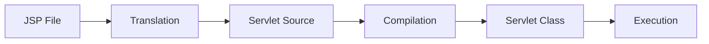

# JSP cơ bản

JSP (JavaServer Pages) là công nghệ cho phép tạo trang web động bằng cách nhúng Java code vào HTML.

## Tổng quan

### JSP là gì?

JSP là một template engine cho phép viết HTML với các đoạn Java code nhúng vào. JSP được compile thành Servlet bởi container.

### JSP Lifecycle



---

## Cú pháp JSP

### Scriptlet `<% %>`

Chứa Java code.

```jsp
<%
    String name = "John";
    int age = 25;
    
    for (int i = 0; i < 5; i++) {
        out.println("Count: " + i + "<br>");
    }
%>
```

### Expression `<%= %>`

In giá trị ra output.

```jsp
<p>Name: <%= name %></p>
<p>Age: <%= age %></p>
<p>Current time: <%= new java.util.Date() %></p>
```

### Declaration `<%! %>`

Khai báo biến/method ở class level.

```jsp
<%!
    private int count = 0;
    
    public String formatDate(java.util.Date date) {
        return new java.text.SimpleDateFormat("dd/MM/yyyy").format(date);
    }
%>

<p>Visit count: <%= ++count %></p>
<p>Date: <%= formatDate(new java.util.Date()) %></p>
```

### Directive `<%@ %>`

Cấu hình JSP page.

```jsp
<%@ page language="java" contentType="text/html; charset=UTF-8" pageEncoding="UTF-8" %>
<%@ page import="java.util.*, com.example.model.*" %>
<%@ page errorPage="error.jsp" %>
<%@ page isErrorPage="true" %>

<%@ include file="header.jsp" %>

<%@ taglib uri="http://java.sun.com/jsp/jstl/core" prefix="c" %>
```

### Comment

```jsp
<%-- JSP comment - không hiển thị trong HTML output --%>

<!-- HTML comment - hiển thị trong HTML output -->
```

---

## Implicit Objects

JSP cung cấp sẵn các object có thể sử dụng trực tiếp:

| Object | Type | Mô tả |
|--------|------|-------|
| `request` | HttpServletRequest | Request object |
| `response` | HttpServletResponse | Response object |
| `session` | HttpSession | Session object |
| `application` | ServletContext | Application context |
| `out` | JspWriter | Output stream |
| `config` | ServletConfig | Servlet config |
| `pageContext` | PageContext | Page context |
| `page` | Object | This servlet |
| `exception` | Throwable | Exception (error page only) |

```jsp
<%
    // Request
    String name = request.getParameter("name");
    String method = request.getMethod();
    
    // Session
    session.setAttribute("user", user);
    User user = (User) session.getAttribute("user");
    
    // Application
    application.setAttribute("appName", "My App");
    
    // Out
    out.println("Hello World");
%>
```

---

## JSTL (JSP Standard Tag Library)

### Cài đặt

```xml
<dependency>
    <groupId>jakarta.servlet.jsp.jstl</groupId>
    <artifactId>jakarta.servlet.jsp.jstl-api</artifactId>
    <version>3.0.0</version>
</dependency>
<dependency>
    <groupId>org.glassfish.web</groupId>
    <artifactId>jakarta.servlet.jsp.jstl</artifactId>
    <version>3.0.1</version>
</dependency>
```

### Core Tags (c:)

```jsp
<%@ taglib uri="jakarta.tags.core" prefix="c" %>

<!-- c:out - in giá trị (escape HTML) -->
<c:out value="${user.name}" />
<c:out value="${user.bio}" default="No bio" escapeXml="true" />

<!-- c:set - gán giá trị -->
<c:set var="count" value="10" />
<c:set var="user" value="${sessionScope.currentUser}" scope="request" />

<!-- c:remove - xóa biến -->
<c:remove var="tempData" scope="session" />

<!-- c:if - điều kiện -->
<c:if test="${user != null}">
    <p>Welcome, ${user.name}!</p>
</c:if>

<c:if test="${empty products}">
    <p>No products found.</p>
</c:if>

<!-- c:choose/when/otherwise - switch -->
<c:choose>
    <c:when test="${user.role == 'ADMIN'}">
        <p>Admin Dashboard</p>
    </c:when>
    <c:when test="${user.role == 'USER'}">
        <p>User Dashboard</p>
    </c:when>
    <c:otherwise>
        <p>Guest Dashboard</p>
    </c:otherwise>
</c:choose>

<!-- c:forEach - vòng lặp -->
<table>
    <c:forEach var="product" items="${products}" varStatus="status">
        <tr class="${status.index % 2 == 0 ? 'even' : 'odd'}">
            <td>${status.count}</td>
            <td>${product.name}</td>
            <td>${product.price}</td>
        </tr>
    </c:forEach>
</table>

<!-- c:forEach với số -->
<c:forEach var="i" begin="1" end="10" step="2">
    <span>${i}</span>
</c:forEach>

<!-- c:forTokens - tách chuỗi -->
<c:forTokens var="color" items="red,green,blue" delims=",">
    <span style="color: ${color}">${color}</span>
</c:forTokens>

<!-- c:url - tạo URL -->
<c:url var="productUrl" value="/products">
    <c:param name="category" value="electronics" />
    <c:param name="page" value="1" />
</c:url>
<a href="${productUrl}">View Products</a>

<!-- c:redirect -->
<c:if test="${user == null}">
    <c:redirect url="/login" />
</c:if>

<!-- c:import - include content -->
<c:import url="/WEB-INF/includes/header.jsp" />
```

### Format Tags (fmt:)

```jsp
<%@ taglib uri="jakarta.tags.fmt" prefix="fmt" %>

<!-- Số -->
<fmt:formatNumber value="${product.price}" type="currency" currencyCode="VND" />
<fmt:formatNumber value="${percentage}" type="percent" />
<fmt:formatNumber value="${number}" pattern="#,###.00" />

<!-- Ngày -->
<fmt:formatDate value="${order.date}" pattern="dd/MM/yyyy HH:mm" />
<fmt:formatDate value="${order.date}" type="both" dateStyle="long" timeStyle="short" />

<!-- Locale -->
<fmt:setLocale value="vi_VN" />

<!-- Parse -->
<fmt:parseNumber var="num" value="1,234.56" />
<fmt:parseDate var="date" value="15/01/2024" pattern="dd/MM/yyyy" />
```

### Functions (fn:)

```jsp
<%@ taglib uri="jakarta.tags.functions" prefix="fn" %>

<!-- String functions -->
<p>Length: ${fn:length(name)}</p>
<p>Upper: ${fn:toUpperCase(name)}</p>
<p>Lower: ${fn:toLowerCase(name)}</p>
<p>Substring: ${fn:substring(name, 0, 5)}</p>
<p>Contains: ${fn:contains(name, 'John')}</p>
<p>StartsWith: ${fn:startsWith(name, 'J')}</p>
<p>EndsWith: ${fn:endsWith(name, 'n')}</p>
<p>Replace: ${fn:replace(name, 'o', '0')}</p>
<p>Trim: ${fn:trim(name)}</p>
<p>Split: ${fn:split(csv, ',')}</p>
<p>Join: ${fn:join(array, ', ')}</p>

<!-- Collection -->
<c:if test="${fn:length(products) > 0}">
    <p>Found ${fn:length(products)} products</p>
</c:if>
```

---

## Expression Language (EL)

### Cú pháp

```jsp
${expression}
```

### Truy cập data

```jsp
<!-- Request parameter -->
${param.name}
${paramValues.hobbies[0]}

<!-- Request attribute -->
${requestScope.user}
${user}  <!-- Tìm trong page -> request -> session -> application -->

<!-- Session attribute -->
${sessionScope.cart}

<!-- Application attribute -->
${applicationScope.config}

<!-- Header -->
${header['User-Agent']}

<!-- Cookie -->
${cookie.username.value}

<!-- Context path -->
${pageContext.request.contextPath}
```

### Operators

```jsp
<!-- Arithmetic -->
${10 + 5}
${10 - 5}
${10 * 5}
${10 / 5} hoặc ${10 div 5}
${10 % 3} hoặc ${10 mod 3}

<!-- Comparison -->
${a == b} hoặc ${a eq b}
${a != b} hoặc ${a ne b}
${a < b} hoặc ${a lt b}
${a > b} hoặc ${a gt b}
${a <= b} hoặc ${a le b}
${a >= b} hoặc ${a ge b}

<!-- Logical -->
${a && b} hoặc ${a and b}
${a || b} hoặc ${a or b}
${!a} hoặc ${not a}

<!-- Empty -->
${empty list}  <!-- true nếu null hoặc rỗng -->
${not empty list}

<!-- Ternary -->
${user != null ? user.name : 'Guest'}
```

---

## Ví dụ thực tế

### Layout với Include

**header.jsp**
```jsp
<%@ page contentType="text/html;charset=UTF-8" %>
<%@ taglib uri="jakarta.tags.core" prefix="c" %>
<!DOCTYPE html>
<html>
<head>
    <meta charset="UTF-8">
    <title>${pageTitle} - My App</title>
    <link rel="stylesheet" href="${pageContext.request.contextPath}/css/style.css">
</head>
<body>
    <header>
        <nav>
            <a href="${pageContext.request.contextPath}/">Home</a>
            <a href="${pageContext.request.contextPath}/products">Products</a>
            <c:choose>
                <c:when test="${sessionScope.user != null}">
                    <span>Welcome, ${sessionScope.user.name}</span>
                    <a href="${pageContext.request.contextPath}/logout">Logout</a>
                </c:when>
                <c:otherwise>
                    <a href="${pageContext.request.contextPath}/login">Login</a>
                </c:otherwise>
            </c:choose>
        </nav>
    </header>
    <main>
```

**footer.jsp**
```jsp
    </main>
    <footer>
        <p>&copy; 2024 My App</p>
    </footer>
</body>
</html>
```

**products.jsp**
```jsp
<%@ page contentType="text/html;charset=UTF-8" %>
<%@ taglib uri="jakarta.tags.core" prefix="c" %>
<%@ taglib uri="jakarta.tags.fmt" prefix="fmt" %>

<c:set var="pageTitle" value="Products" scope="request" />
<%@ include file="/WEB-INF/includes/header.jsp" %>

<h1>Product List</h1>

<c:if test="${not empty message}">
    <div class="alert alert-success">${message}</div>
</c:if>

<c:choose>
    <c:when test="${empty products}">
        <p>No products found.</p>
    </c:when>
    <c:otherwise>
        <table>
            <thead>
                <tr>
                    <th>#</th>
                    <th>Name</th>
                    <th>Price</th>
                    <th>Stock</th>
                    <th>Actions</th>
                </tr>
            </thead>
            <tbody>
                <c:forEach var="product" items="${products}" varStatus="status">
                    <tr>
                        <td>${status.count}</td>
                        <td><c:out value="${product.name}" /></td>
                        <td>
                            <fmt:formatNumber value="${product.price}" 
                                              type="currency" 
                                              currencyCode="VND" />
                        </td>
                        <td>
                            <c:choose>
                                <c:when test="${product.stock > 10}">
                                    <span class="in-stock">${product.stock}</span>
                                </c:when>
                                <c:when test="${product.stock > 0}">
                                    <span class="low-stock">${product.stock}</span>
                                </c:when>
                                <c:otherwise>
                                    <span class="out-of-stock">Out of stock</span>
                                </c:otherwise>
                            </c:choose>
                        </td>
                        <td>
                            <a href="${pageContext.request.contextPath}/products/edit?id=${product.id}">Edit</a>
                            <a href="${pageContext.request.contextPath}/products/delete?id=${product.id}" 
                               onclick="return confirm('Are you sure?')">Delete</a>
                        </td>
                    </tr>
                </c:forEach>
            </tbody>
        </table>
    </c:otherwise>
</c:choose>

<a href="${pageContext.request.contextPath}/products/add">Add New Product</a>

<%@ include file="/WEB-INF/includes/footer.jsp" %>
```

### Form với Validation

```jsp
<%@ page contentType="text/html;charset=UTF-8" %>
<%@ taglib uri="jakarta.tags.core" prefix="c" %>

<c:set var="pageTitle" value="Add Product" scope="request" />
<%@ include file="/WEB-INF/includes/header.jsp" %>

<h1>Add New Product</h1>

<c:if test="${not empty errors}">
    <div class="alert alert-danger">
        <ul>
            <c:forEach var="error" items="${errors}">
                <li>${error}</li>
            </c:forEach>
        </ul>
    </div>
</c:if>

<form action="${pageContext.request.contextPath}/products/add" method="post">
    <div class="form-group">
        <label for="name">Product Name:</label>
        <input type="text" id="name" name="name" 
               value="<c:out value='${param.name}' />" required>
    </div>
    
    <div class="form-group">
        <label for="price">Price:</label>
        <input type="number" id="price" name="price" step="0.01"
               value="${param.price}" required>
    </div>
    
    <div class="form-group">
        <label for="category">Category:</label>
        <select id="category" name="category">
            <c:forEach var="cat" items="${categories}">
                <option value="${cat.id}" 
                        ${param.category == cat.id ? 'selected' : ''}>
                    ${cat.name}
                </option>
            </c:forEach>
        </select>
    </div>
    
    <div class="form-group">
        <label for="description">Description:</label>
        <textarea id="description" name="description" rows="4"><c:out value='${param.description}' /></textarea>
    </div>
    
    <button type="submit">Add Product</button>
    <a href="${pageContext.request.contextPath}/products">Cancel</a>
</form>

<%@ include file="/WEB-INF/includes/footer.jsp" %>
```

---

## Best Practices

1. **Không viết Java code trong JSP** - Sử dụng JSTL và EL thay vì scriptlet
2. **Đặt JSP trong WEB-INF** - Ngăn truy cập trực tiếp
3. **Sử dụng c:out** - Escape HTML để tránh XSS
4. **Tách layout** - Sử dụng include cho header/footer
5. **Validate ở Servlet** - JSP chỉ hiển thị

---

## Bài tập thực hành

!!! example "Bài tập"
    Tạo trang quản lý sinh viên với:
    
    1. Danh sách sinh viên (sử dụng c:forEach)
    2. Form thêm/sửa sinh viên
    3. Hiển thị thông báo lỗi/thành công
    4. Phân trang

## Tiếp theo

- [MVC Pattern](mvc.md)
