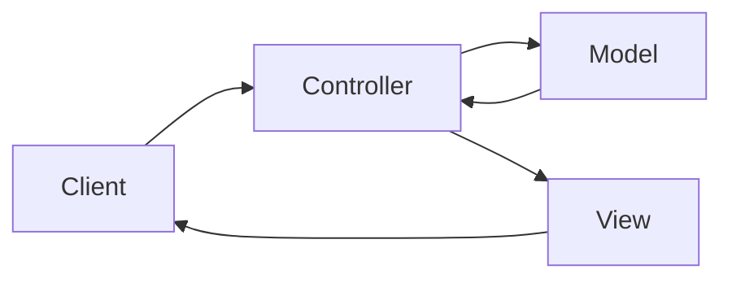

# MVC Pattern

MVC (Model-View-Controller) là một design pattern phổ biến trong phát triển web, giúp tách biệt các thành phần của ứng dụng.

## Tổng quan

### MVC là gì?

MVC chia ứng dụng thành 3 thành phần:



| Thành phần | Vai trò | Trong Java Web |
|------------|---------|----------------|
| **Model** | Dữ liệu và business logic | JavaBean, Service, DAO |
| **View** | Hiển thị giao diện | JSP, HTML |
| **Controller** | Điều phối request | Servlet |

### Luồng xử lý

1. Client gửi request đến Controller (Servlet)
2. Controller xử lý request, gọi Model để lấy/xử lý dữ liệu
3. Controller chọn View phù hợp và truyền dữ liệu
4. View render HTML và trả về cho Client

---

## Cấu trúc Project

```
src/main/
├── java/com/example/
│   ├── controller/          # Servlets
│   │   ├── ProductController.java
│   │   └── UserController.java
│   ├── model/               # Entity classes
│   │   ├── Product.java
│   │   └── User.java
│   ├── service/             # Business logic
│   │   ├── ProductService.java
│   │   └── UserService.java
│   ├── dao/                 # Data access
│   │   ├── ProductDAO.java
│   │   └── UserDAO.java
│   └── util/                # Utilities
│       └── DBConnection.java
└── webapp/
    ├── WEB-INF/
    │   ├── views/           # JSP files
    │   │   ├── product/
    │   │   │   ├── list.jsp
    │   │   │   ├── form.jsp
    │   │   │   └── detail.jsp
    │   │   └── user/
    │   │       ├── login.jsp
    │   │       └── register.jsp
    │   └── web.xml
    ├── css/
    ├── js/
    └── images/
```

---

## Model Layer

### Entity (JavaBean)

```java
package com.example.model;

public class Product {
    private Long id;
    private String name;
    private String description;
    private double price;
    private int stock;
    private Long categoryId;
    
    // Default constructor
    public Product() {}
    
    // Constructor with fields
    public Product(String name, double price, int stock) {
        this.name = name;
        this.price = price;
        this.stock = stock;
    }
    
    // Getters and Setters
    public Long getId() { return id; }
    public void setId(Long id) { this.id = id; }
    
    public String getName() { return name; }
    public void setName(String name) { this.name = name; }
    
    public String getDescription() { return description; }
    public void setDescription(String description) { this.description = description; }
    
    public double getPrice() { return price; }
    public void setPrice(double price) { this.price = price; }
    
    public int getStock() { return stock; }
    public void setStock(int stock) { this.stock = stock; }
    
    public Long getCategoryId() { return categoryId; }
    public void setCategoryId(Long categoryId) { this.categoryId = categoryId; }
}
```

### DAO (Data Access Object)

```java
package com.example.dao;

import com.example.model.Product;
import com.example.util.DBConnection;
import java.sql.*;
import java.util.ArrayList;
import java.util.List;

public class ProductDAO {
    
    public List<Product> findAll() {
        List<Product> products = new ArrayList<>();
        String sql = "SELECT * FROM products ORDER BY id DESC";
        
        try (Connection conn = DBConnection.getConnection();
             Statement stmt = conn.createStatement();
             ResultSet rs = stmt.executeQuery(sql)) {
            
            while (rs.next()) {
                products.add(mapResultSetToProduct(rs));
            }
        } catch (SQLException e) {
            e.printStackTrace();
        }
        return products;
    }
    
    public Product findById(Long id) {
        String sql = "SELECT * FROM products WHERE id = ?";
        
        try (Connection conn = DBConnection.getConnection();
             PreparedStatement stmt = conn.prepareStatement(sql)) {
            
            stmt.setLong(1, id);
            ResultSet rs = stmt.executeQuery();
            
            if (rs.next()) {
                return mapResultSetToProduct(rs);
            }
        } catch (SQLException e) {
            e.printStackTrace();
        }
        return null;
    }
    
    public boolean save(Product product) {
        String sql = "INSERT INTO products (name, description, price, stock, category_id) VALUES (?, ?, ?, ?, ?)";
        
        try (Connection conn = DBConnection.getConnection();
             PreparedStatement stmt = conn.prepareStatement(sql, Statement.RETURN_GENERATED_KEYS)) {
            
            stmt.setString(1, product.getName());
            stmt.setString(2, product.getDescription());
            stmt.setDouble(3, product.getPrice());
            stmt.setInt(4, product.getStock());
            stmt.setLong(5, product.getCategoryId());
            
            int rows = stmt.executeUpdate();
            
            if (rows > 0) {
                ResultSet rs = stmt.getGeneratedKeys();
                if (rs.next()) {
                    product.setId(rs.getLong(1));
                }
                return true;
            }
        } catch (SQLException e) {
            e.printStackTrace();
        }
        return false;
    }
    
    public boolean update(Product product) {
        String sql = "UPDATE products SET name = ?, description = ?, price = ?, stock = ?, category_id = ? WHERE id = ?";
        
        try (Connection conn = DBConnection.getConnection();
             PreparedStatement stmt = conn.prepareStatement(sql)) {
            
            stmt.setString(1, product.getName());
            stmt.setString(2, product.getDescription());
            stmt.setDouble(3, product.getPrice());
            stmt.setInt(4, product.getStock());
            stmt.setLong(5, product.getCategoryId());
            stmt.setLong(6, product.getId());
            
            return stmt.executeUpdate() > 0;
        } catch (SQLException e) {
            e.printStackTrace();
        }
        return false;
    }
    
    public boolean delete(Long id) {
        String sql = "DELETE FROM products WHERE id = ?";
        
        try (Connection conn = DBConnection.getConnection();
             PreparedStatement stmt = conn.prepareStatement(sql)) {
            
            stmt.setLong(1, id);
            return stmt.executeUpdate() > 0;
        } catch (SQLException e) {
            e.printStackTrace();
        }
        return false;
    }
    
    private Product mapResultSetToProduct(ResultSet rs) throws SQLException {
        Product product = new Product();
        product.setId(rs.getLong("id"));
        product.setName(rs.getString("name"));
        product.setDescription(rs.getString("description"));
        product.setPrice(rs.getDouble("price"));
        product.setStock(rs.getInt("stock"));
        product.setCategoryId(rs.getLong("category_id"));
        return product;
    }
}
```

### Service Layer

```java
package com.example.service;

import com.example.dao.ProductDAO;
import com.example.model.Product;
import java.util.List;
import java.util.ArrayList;

public class ProductService {
    private ProductDAO productDAO;
    
    public ProductService() {
        this.productDAO = new ProductDAO();
    }
    
    public List<Product> getAllProducts() {
        return productDAO.findAll();
    }
    
    public Product getProductById(Long id) {
        return productDAO.findById(id);
    }
    
    public List<String> validateProduct(Product product) {
        List<String> errors = new ArrayList<>();
        
        if (product.getName() == null || product.getName().trim().isEmpty()) {
            errors.add("Product name is required");
        }
        if (product.getPrice() <= 0) {
            errors.add("Price must be greater than 0");
        }
        if (product.getStock() < 0) {
            errors.add("Stock cannot be negative");
        }
        
        return errors;
    }
    
    public boolean createProduct(Product product) {
        return productDAO.save(product);
    }
    
    public boolean updateProduct(Product product) {
        return productDAO.update(product);
    }
    
    public boolean deleteProduct(Long id) {
        return productDAO.delete(id);
    }
}
```

---

## Controller Layer

### Product Controller

```java
package com.example.controller;

import com.example.model.Product;
import com.example.service.ProductService;
import jakarta.servlet.ServletException;
import jakarta.servlet.annotation.WebServlet;
import jakarta.servlet.http.HttpServlet;
import jakarta.servlet.http.HttpServletRequest;
import jakarta.servlet.http.HttpServletResponse;
import java.io.IOException;
import java.util.List;

@WebServlet("/products/*")
public class ProductController extends HttpServlet {
    
    private ProductService productService;
    
    @Override
    public void init() throws ServletException {
        productService = new ProductService();
    }
    
    @Override
    protected void doGet(HttpServletRequest request, HttpServletResponse response) 
            throws ServletException, IOException {
        
        String pathInfo = request.getPathInfo();
        
        if (pathInfo == null || pathInfo.equals("/")) {
            listProducts(request, response);
        } else if (pathInfo.equals("/add")) {
            showAddForm(request, response);
        } else if (pathInfo.equals("/edit")) {
            showEditForm(request, response);
        } else if (pathInfo.equals("/delete")) {
            deleteProduct(request, response);
        } else if (pathInfo.startsWith("/view/")) {
            viewProduct(request, response);
        } else {
            response.sendError(HttpServletResponse.SC_NOT_FOUND);
        }
    }
    
    @Override
    protected void doPost(HttpServletRequest request, HttpServletResponse response) 
            throws ServletException, IOException {
        
        request.setCharacterEncoding("UTF-8");
        String pathInfo = request.getPathInfo();
        
        if (pathInfo.equals("/add")) {
            addProduct(request, response);
        } else if (pathInfo.equals("/edit")) {
            updateProduct(request, response);
        } else {
            response.sendError(HttpServletResponse.SC_NOT_FOUND);
        }
    }
    
    private void listProducts(HttpServletRequest request, HttpServletResponse response) 
            throws ServletException, IOException {
        
        List<Product> products = productService.getAllProducts();
        request.setAttribute("products", products);
        
        request.getRequestDispatcher("/WEB-INF/views/product/list.jsp")
               .forward(request, response);
    }
    
    private void showAddForm(HttpServletRequest request, HttpServletResponse response) 
            throws ServletException, IOException {
        
        request.getRequestDispatcher("/WEB-INF/views/product/form.jsp")
               .forward(request, response);
    }
    
    private void showEditForm(HttpServletRequest request, HttpServletResponse response) 
            throws ServletException, IOException {
        
        Long id = Long.parseLong(request.getParameter("id"));
        Product product = productService.getProductById(id);
        
        if (product == null) {
            response.sendError(HttpServletResponse.SC_NOT_FOUND);
            return;
        }
        
        request.setAttribute("product", product);
        request.getRequestDispatcher("/WEB-INF/views/product/form.jsp")
               .forward(request, response);
    }
    
    private void viewProduct(HttpServletRequest request, HttpServletResponse response) 
            throws ServletException, IOException {
        
        String pathInfo = request.getPathInfo();
        Long id = Long.parseLong(pathInfo.substring("/view/".length()));
        
        Product product = productService.getProductById(id);
        
        if (product == null) {
            response.sendError(HttpServletResponse.SC_NOT_FOUND);
            return;
        }
        
        request.setAttribute("product", product);
        request.getRequestDispatcher("/WEB-INF/views/product/detail.jsp")
               .forward(request, response);
    }
    
    private void addProduct(HttpServletRequest request, HttpServletResponse response) 
            throws ServletException, IOException {
        
        Product product = extractProductFromRequest(request);
        
        List<String> errors = productService.validateProduct(product);
        
        if (!errors.isEmpty()) {
            request.setAttribute("errors", errors);
            request.setAttribute("product", product);
            request.getRequestDispatcher("/WEB-INF/views/product/form.jsp")
                   .forward(request, response);
            return;
        }
        
        if (productService.createProduct(product)) {
            request.getSession().setAttribute("message", "Product added successfully!");
            response.sendRedirect(request.getContextPath() + "/products");
        } else {
            request.setAttribute("error", "Failed to add product");
            request.getRequestDispatcher("/WEB-INF/views/product/form.jsp")
                   .forward(request, response);
        }
    }
    
    private void updateProduct(HttpServletRequest request, HttpServletResponse response) 
            throws ServletException, IOException {
        
        Long id = Long.parseLong(request.getParameter("id"));
        Product product = extractProductFromRequest(request);
        product.setId(id);
        
        List<String> errors = productService.validateProduct(product);
        
        if (!errors.isEmpty()) {
            request.setAttribute("errors", errors);
            request.setAttribute("product", product);
            request.getRequestDispatcher("/WEB-INF/views/product/form.jsp")
                   .forward(request, response);
            return;
        }
        
        if (productService.updateProduct(product)) {
            request.getSession().setAttribute("message", "Product updated successfully!");
            response.sendRedirect(request.getContextPath() + "/products");
        } else {
            request.setAttribute("error", "Failed to update product");
            request.getRequestDispatcher("/WEB-INF/views/product/form.jsp")
                   .forward(request, response);
        }
    }
    
    private void deleteProduct(HttpServletRequest request, HttpServletResponse response) 
            throws IOException {
        
        Long id = Long.parseLong(request.getParameter("id"));
        
        if (productService.deleteProduct(id)) {
            request.getSession().setAttribute("message", "Product deleted successfully!");
        } else {
            request.getSession().setAttribute("error", "Failed to delete product");
        }
        
        response.sendRedirect(request.getContextPath() + "/products");
    }
    
    private Product extractProductFromRequest(HttpServletRequest request) {
        Product product = new Product();
        product.setName(request.getParameter("name"));
        product.setDescription(request.getParameter("description"));
        
        String priceStr = request.getParameter("price");
        if (priceStr != null && !priceStr.isEmpty()) {
            product.setPrice(Double.parseDouble(priceStr));
        }
        
        String stockStr = request.getParameter("stock");
        if (stockStr != null && !stockStr.isEmpty()) {
            product.setStock(Integer.parseInt(stockStr));
        }
        
        String categoryIdStr = request.getParameter("categoryId");
        if (categoryIdStr != null && !categoryIdStr.isEmpty()) {
            product.setCategoryId(Long.parseLong(categoryIdStr));
        }
        
        return product;
    }
}
```

---

## View Layer

### list.jsp

```jsp
<%@ page contentType="text/html;charset=UTF-8" %>
<%@ taglib uri="jakarta.tags.core" prefix="c" %>
<%@ taglib uri="jakarta.tags.fmt" prefix="fmt" %>

<!DOCTYPE html>
<html>
<head>
    <meta charset="UTF-8">
    <title>Product List</title>
    <link rel="stylesheet" href="${pageContext.request.contextPath}/css/style.css">
</head>
<body>
    <div class="container">
        <h1>Product Management</h1>
        
        <c:if test="${not empty sessionScope.message}">
            <div class="alert alert-success">
                ${sessionScope.message}
                <c:remove var="message" scope="session" />
            </div>
        </c:if>
        
        <c:if test="${not empty sessionScope.error}">
            <div class="alert alert-danger">
                ${sessionScope.error}
                <c:remove var="error" scope="session" />
            </div>
        </c:if>
        
        <a href="${pageContext.request.contextPath}/products/add" class="btn btn-primary">
            Add New Product
        </a>
        
        <table class="table">
            <thead>
                <tr>
                    <th>ID</th>
                    <th>Name</th>
                    <th>Price</th>
                    <th>Stock</th>
                    <th>Actions</th>
                </tr>
            </thead>
            <tbody>
                <c:forEach var="product" items="${products}">
                    <tr>
                        <td>${product.id}</td>
                        <td>
                            <a href="${pageContext.request.contextPath}/products/view/${product.id}">
                                <c:out value="${product.name}" />
                            </a>
                        </td>
                        <td>
                            <fmt:formatNumber value="${product.price}" type="currency" currencyCode="VND" />
                        </td>
                        <td>${product.stock}</td>
                        <td>
                            <a href="${pageContext.request.contextPath}/products/edit?id=${product.id}" 
                               class="btn btn-sm btn-warning">Edit</a>
                            <a href="${pageContext.request.contextPath}/products/delete?id=${product.id}" 
                               class="btn btn-sm btn-danger"
                               onclick="return confirm('Are you sure?')">Delete</a>
                        </td>
                    </tr>
                </c:forEach>
            </tbody>
        </table>
    </div>
</body>
</html>
```

### form.jsp

```jsp
<%@ page contentType="text/html;charset=UTF-8" %>
<%@ taglib uri="jakarta.tags.core" prefix="c" %>

<!DOCTYPE html>
<html>
<head>
    <meta charset="UTF-8">
    <title>${empty product.id ? 'Add' : 'Edit'} Product</title>
    <link rel="stylesheet" href="${pageContext.request.contextPath}/css/style.css">
</head>
<body>
    <div class="container">
        <h1>${empty product.id ? 'Add New' : 'Edit'} Product</h1>
        
        <c:if test="${not empty errors}">
            <div class="alert alert-danger">
                <ul>
                    <c:forEach var="error" items="${errors}">
                        <li>${error}</li>
                    </c:forEach>
                </ul>
            </div>
        </c:if>
        
        <form action="${pageContext.request.contextPath}/products/${empty product.id ? 'add' : 'edit'}" 
              method="post">
            
            <c:if test="${not empty product.id}">
                <input type="hidden" name="id" value="${product.id}">
            </c:if>
            
            <div class="form-group">
                <label for="name">Product Name *</label>
                <input type="text" id="name" name="name" 
                       value="<c:out value='${product.name}' />" required>
            </div>
            
            <div class="form-group">
                <label for="description">Description</label>
                <textarea id="description" name="description" rows="4"><c:out value='${product.description}' /></textarea>
            </div>
            
            <div class="form-group">
                <label for="price">Price *</label>
                <input type="number" id="price" name="price" step="0.01" min="0"
                       value="${product.price}" required>
            </div>
            
            <div class="form-group">
                <label for="stock">Stock *</label>
                <input type="number" id="stock" name="stock" min="0"
                       value="${product.stock}" required>
            </div>
            
            <div class="form-actions">
                <button type="submit" class="btn btn-primary">
                    ${empty product.id ? 'Add' : 'Update'} Product
                </button>
                <a href="${pageContext.request.contextPath}/products" class="btn btn-secondary">
                    Cancel
                </a>
            </div>
        </form>
    </div>
</body>
</html>
```

---

## Front Controller Pattern

Sử dụng một Servlet duy nhất làm điểm vào cho tất cả request.

```java
@WebServlet("/")
public class FrontController extends HttpServlet {
    
    @Override
    protected void service(HttpServletRequest request, HttpServletResponse response) 
            throws ServletException, IOException {
        
        String uri = request.getRequestURI();
        String contextPath = request.getContextPath();
        String path = uri.substring(contextPath.length());
        
        // Route to appropriate controller
        if (path.startsWith("/products")) {
            new ProductController().service(request, response);
        } else if (path.startsWith("/users")) {
            new UserController().service(request, response);
        } else if (path.equals("/") || path.equals("/home")) {
            request.getRequestDispatcher("/WEB-INF/views/home.jsp")
                   .forward(request, response);
        } else {
            response.sendError(HttpServletResponse.SC_NOT_FOUND);
        }
    }
}
```

---

## Best Practices

1. **Thin Controller**: Controller chỉ điều phối, logic nằm ở Service
2. **No business logic in JSP**: JSP chỉ hiển thị
3. **Use PRG Pattern**: Post-Redirect-Get để tránh duplicate submission
4. **Validate at Service layer**: Tập trung validation ở một nơi
5. **Use DTO**: Tách biệt entity và data transfer object
6. **Handle exceptions**: Tạo error page chung

---

## Bài tập thực hành

!!! example "Bài tập"
    Xây dựng ứng dụng quản lý sinh viên theo MVC:
    
    1. Model: Student (id, name, email, gpa)
    2. DAO: CRUD operations
    3. Service: Validation, business logic
    4. Controller: StudentController
    5. Views: list, form, detail

## Tiếp theo

- [Spring Boot cơ bản](../spring/springboot-basic.md)
