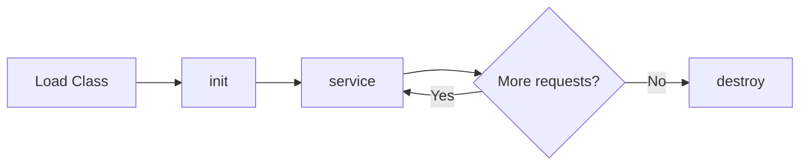

# Servlet cơ bản

Servlet là một Java class chạy trên web server, xử lý các HTTP request và trả về HTTP response.

## Tổng quan

### Servlet là gì?

Servlet là một component của Java EE (Jakarta EE) cho phép xây dựng ứng dụng web động. Servlet chạy trên Servlet Container (như Tomcat, Jetty) và xử lý các request từ client.

### Servlet Lifecycle



1. **init()**: Được gọi một lần khi servlet được load
2. **service()**: Được gọi cho mỗi request (gọi doGet/doPost/...)
3. **destroy()**: Được gọi khi servlet bị unload

---

## Tạo Servlet

### Cấu trúc project Maven

```
my-webapp/
├── pom.xml
└── src/
    └── main/
        ├── java/
        │   └── com/example/
        │       └── HelloServlet.java
        └── webapp/
            └── WEB-INF/
                └── web.xml
```

### pom.xml

```xml
<project>
    <modelVersion>4.0.0</modelVersion>
    <groupId>com.example</groupId>
    <artifactId>my-webapp</artifactId>
    <version>1.0</version>
    <packaging>war</packaging>
    
    <dependencies>
        <dependency>
            <groupId>jakarta.servlet</groupId>
            <artifactId>jakarta.servlet-api</artifactId>
            <version>6.0.0</version>
            <scope>provided</scope>
        </dependency>
    </dependencies>
</project>
```

### Hello Servlet

```java
package com.example;

import jakarta.servlet.ServletException;
import jakarta.servlet.annotation.WebServlet;
import jakarta.servlet.http.HttpServlet;
import jakarta.servlet.http.HttpServletRequest;
import jakarta.servlet.http.HttpServletResponse;
import java.io.IOException;
import java.io.PrintWriter;

@WebServlet("/hello")
public class HelloServlet extends HttpServlet {
    
    @Override
    public void init() throws ServletException {
        System.out.println("Servlet initialized");
    }
    
    @Override
    protected void doGet(HttpServletRequest request, 
                         HttpServletResponse response) 
            throws ServletException, IOException {
        
        response.setContentType("text/html;charset=UTF-8");
        
        PrintWriter out = response.getWriter();
        out.println("<!DOCTYPE html>");
        out.println("<html>");
        out.println("<head><title>Hello Servlet</title></head>");
        out.println("<body>");
        out.println("<h1>Hello, World!</h1>");
        out.println("</body>");
        out.println("</html>");
    }
    
    @Override
    public void destroy() {
        System.out.println("Servlet destroyed");
    }
}
```

---

## HTTP Methods

### doGet - Xử lý GET request

```java
@WebServlet("/products")
public class ProductServlet extends HttpServlet {
    
    @Override
    protected void doGet(HttpServletRequest request, 
                         HttpServletResponse response) 
            throws ServletException, IOException {
        
        // Lấy query parameter
        String category = request.getParameter("category");
        String page = request.getParameter("page");
        
        // Xử lý logic
        List<Product> products = productService.findByCategory(category);
        
        // Set attribute để forward sang JSP
        request.setAttribute("products", products);
        
        // Forward sang JSP
        request.getRequestDispatcher("/WEB-INF/views/products.jsp")
               .forward(request, response);
    }
}
```

### doPost - Xử lý POST request

```java
@WebServlet("/register")
public class RegisterServlet extends HttpServlet {
    
    @Override
    protected void doGet(HttpServletRequest request, 
                         HttpServletResponse response) 
            throws ServletException, IOException {
        // Hiển thị form đăng ký
        request.getRequestDispatcher("/WEB-INF/views/register.jsp")
               .forward(request, response);
    }
    
    @Override
    protected void doPost(HttpServletRequest request, 
                          HttpServletResponse response) 
            throws ServletException, IOException {
        
        // Set encoding cho tiếng Việt
        request.setCharacterEncoding("UTF-8");
        
        // Lấy form data
        String username = request.getParameter("username");
        String email = request.getParameter("email");
        String password = request.getParameter("password");
        
        // Validate
        List<String> errors = new ArrayList<>();
        if (username == null || username.trim().isEmpty()) {
            errors.add("Username is required");
        }
        if (email == null || !email.contains("@")) {
            errors.add("Invalid email");
        }
        
        if (!errors.isEmpty()) {
            request.setAttribute("errors", errors);
            request.getRequestDispatcher("/WEB-INF/views/register.jsp")
                   .forward(request, response);
            return;
        }
        
        // Xử lý đăng ký
        User user = new User(username, email, password);
        userService.register(user);
        
        // Redirect sau khi thành công (PRG pattern)
        response.sendRedirect(request.getContextPath() + "/login?registered=true");
    }
}
```

---

## Request & Response

### HttpServletRequest

```java
// Lấy parameters
String name = request.getParameter("name");
String[] hobbies = request.getParameterValues("hobbies");
Map<String, String[]> allParams = request.getParameterMap();

// Lấy headers
String userAgent = request.getHeader("User-Agent");
String contentType = request.getHeader("Content-Type");
Enumeration<String> headerNames = request.getHeaderNames();

// Lấy thông tin request
String method = request.getMethod();           // GET, POST, ...
String uri = request.getRequestURI();          // /app/hello
String url = request.getRequestURL().toString(); // http://localhost:8080/app/hello
String queryString = request.getQueryString(); // name=John&age=25
String contextPath = request.getContextPath(); // /app
String servletPath = request.getServletPath(); // /hello

// Lấy thông tin client
String remoteAddr = request.getRemoteAddr();   // IP address
String remoteHost = request.getRemoteHost();

// Attributes (để truyền data giữa servlet và JSP)
request.setAttribute("user", user);
Object user = request.getAttribute("user");
request.removeAttribute("user");
```

### HttpServletResponse

```java
// Set content type
response.setContentType("text/html;charset=UTF-8");
response.setContentType("application/json");

// Set headers
response.setHeader("Cache-Control", "no-cache");
response.addHeader("Set-Cookie", "name=value");

// Set status code
response.setStatus(HttpServletResponse.SC_OK);           // 200
response.setStatus(HttpServletResponse.SC_NOT_FOUND);    // 404
response.sendError(HttpServletResponse.SC_FORBIDDEN);    // 403

// Redirect
response.sendRedirect("/login");
response.sendRedirect(request.getContextPath() + "/home");

// Write response
PrintWriter out = response.getWriter();
out.println("<html>...</html>");

// Binary response
OutputStream os = response.getOutputStream();
os.write(bytes);
```

---

## Session Management

### HttpSession

```java
@WebServlet("/login")
public class LoginServlet extends HttpServlet {
    
    @Override
    protected void doPost(HttpServletRequest request, 
                          HttpServletResponse response) 
            throws ServletException, IOException {
        
        String username = request.getParameter("username");
        String password = request.getParameter("password");
        
        User user = userService.authenticate(username, password);
        
        if (user != null) {
            // Tạo session
            HttpSession session = request.getSession();
            session.setAttribute("user", user);
            session.setMaxInactiveInterval(30 * 60); // 30 phút
            
            response.sendRedirect(request.getContextPath() + "/dashboard");
        } else {
            request.setAttribute("error", "Invalid credentials");
            request.getRequestDispatcher("/WEB-INF/views/login.jsp")
                   .forward(request, response);
        }
    }
}

@WebServlet("/dashboard")
public class DashboardServlet extends HttpServlet {
    
    @Override
    protected void doGet(HttpServletRequest request, 
                         HttpServletResponse response) 
            throws ServletException, IOException {
        
        HttpSession session = request.getSession(false);
        
        if (session == null || session.getAttribute("user") == null) {
            response.sendRedirect(request.getContextPath() + "/login");
            return;
        }
        
        User user = (User) session.getAttribute("user");
        request.setAttribute("user", user);
        
        request.getRequestDispatcher("/WEB-INF/views/dashboard.jsp")
               .forward(request, response);
    }
}

@WebServlet("/logout")
public class LogoutServlet extends HttpServlet {
    
    @Override
    protected void doGet(HttpServletRequest request, 
                         HttpServletResponse response) 
            throws ServletException, IOException {
        
        HttpSession session = request.getSession(false);
        if (session != null) {
            session.invalidate();
        }
        
        response.sendRedirect(request.getContextPath() + "/login");
    }
}
```

### Cookie

```java
// Tạo cookie
Cookie cookie = new Cookie("username", "john");
cookie.setMaxAge(7 * 24 * 60 * 60); // 7 ngày
cookie.setPath("/");
cookie.setHttpOnly(true);
cookie.setSecure(true); // Chỉ gửi qua HTTPS
response.addCookie(cookie);

// Đọc cookie
Cookie[] cookies = request.getCookies();
if (cookies != null) {
    for (Cookie c : cookies) {
        if ("username".equals(c.getName())) {
            String username = c.getValue();
        }
    }
}

// Xóa cookie
Cookie cookie = new Cookie("username", "");
cookie.setMaxAge(0);
cookie.setPath("/");
response.addCookie(cookie);
```

---

## Servlet Filter

Filter cho phép xử lý request/response trước và sau khi đến servlet.

```java
@WebFilter("/*")
public class EncodingFilter implements Filter {
    
    @Override
    public void init(FilterConfig filterConfig) throws ServletException {
        // Khởi tạo
    }
    
    @Override
    public void doFilter(ServletRequest request, 
                         ServletResponse response, 
                         FilterChain chain) 
            throws IOException, ServletException {
        
        // Xử lý trước khi đến servlet
        request.setCharacterEncoding("UTF-8");
        response.setCharacterEncoding("UTF-8");
        
        // Chuyển tiếp đến filter/servlet tiếp theo
        chain.doFilter(request, response);
        
        // Xử lý sau khi servlet trả về
    }
    
    @Override
    public void destroy() {
        // Cleanup
    }
}

// Authentication Filter
@WebFilter("/admin/*")
public class AuthFilter implements Filter {
    
    @Override
    public void doFilter(ServletRequest request, 
                         ServletResponse response, 
                         FilterChain chain) 
            throws IOException, ServletException {
        
        HttpServletRequest httpRequest = (HttpServletRequest) request;
        HttpServletResponse httpResponse = (HttpServletResponse) response;
        
        HttpSession session = httpRequest.getSession(false);
        
        if (session == null || session.getAttribute("user") == null) {
            httpResponse.sendRedirect(httpRequest.getContextPath() + "/login");
            return;
        }
        
        chain.doFilter(request, response);
    }
}
```

---

## Servlet Listener

Listener lắng nghe các sự kiện trong ứng dụng.

```java
// Application Listener
@WebListener
public class AppContextListener implements ServletContextListener {
    
    @Override
    public void contextInitialized(ServletContextEvent sce) {
        System.out.println("Application started");
        // Khởi tạo resources, database connection pool, etc.
    }
    
    @Override
    public void contextDestroyed(ServletContextEvent sce) {
        System.out.println("Application stopped");
        // Cleanup resources
    }
}

// Session Listener
@WebListener
public class SessionListener implements HttpSessionListener {
    
    private static AtomicInteger activeSessions = new AtomicInteger(0);
    
    @Override
    public void sessionCreated(HttpSessionEvent se) {
        activeSessions.incrementAndGet();
        System.out.println("Session created. Active: " + activeSessions.get());
    }
    
    @Override
    public void sessionDestroyed(HttpSessionEvent se) {
        activeSessions.decrementAndGet();
        System.out.println("Session destroyed. Active: " + activeSessions.get());
    }
    
    public static int getActiveSessions() {
        return activeSessions.get();
    }
}
```

---

## Forward vs Redirect

| Forward | Redirect |
|---------|----------|
| Server-side | Client-side |
| URL không đổi | URL thay đổi |
| Nhanh hơn | Chậm hơn (2 requests) |
| Chia sẻ request attributes | Không chia sẻ |
| Chỉ trong cùng application | Có thể đến URL khác |

```java
// Forward
request.getRequestDispatcher("/WEB-INF/views/page.jsp")
       .forward(request, response);

// Redirect
response.sendRedirect(request.getContextPath() + "/page");
```

---

## Bài tập thực hành

!!! example "Bài tập"
    Xây dựng ứng dụng quản lý sản phẩm với:
    
    1. Servlet hiển thị danh sách sản phẩm (GET)
    2. Servlet thêm sản phẩm mới (GET: form, POST: xử lý)
    3. Filter kiểm tra đăng nhập
    4. Session lưu thông tin user

## Tiếp theo

- [JSP cơ bản](jsp.md)
