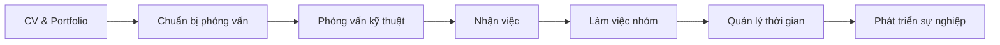

# Kỹ năng mềm

Kỹ năng mềm (Soft Skills) là những kỹ năng không liên quan trực tiếp đến kỹ thuật nhưng rất quan trọng để thành công trong sự nghiệp IT.

## Tại sao cần Kỹ năng mềm?

Theo nhiều nghiên cứu, kỹ năng mềm chiếm đến **85%** yếu tố quyết định thành công trong công việc. Đặc biệt với lập trình viên:

- **Giao tiếp** - Hiểu yêu cầu, trình bày giải pháp, làm việc với team
- **Giải quyết vấn đề** - Phân tích, tư duy logic, sáng tạo
- **Quản lý thời gian** - Ước lượng, ưu tiên, deadline
- **Làm việc nhóm** - Collaboration, code review, pair programming

---

## Nội dung

-   :material-file-document-edit:{ .lg .middle } **CV & Portfolio**

    ---

    Cách viết CV ấn tượng và xây dựng portfolio chuyên nghiệp

    [:octicons-arrow-right-24: Viết CV hiệu quả](cv/viet-cv.md)
    
    [:octicons-arrow-right-24: Xây dựng Portfolio](cv/portfolio.md)

-   :material-account-tie:{ .lg .middle } **Phỏng vấn**

    ---

    Chuẩn bị và vượt qua các vòng phỏng vấn

    [:octicons-arrow-right-24: Chuẩn bị phỏng vấn](interview/chuan-bi.md)
    
    [:octicons-arrow-right-24: Câu hỏi thường gặp](interview/cau-hoi.md)
    
    [:octicons-arrow-right-24: Phỏng vấn kỹ thuật](interview/ky-thuat.md)

-   :material-account-group:{ .lg .middle } **Kỹ năng làm việc**

    ---

    Kỹ năng cần thiết trong môi trường làm việc

    [:octicons-arrow-right-24: Làm việc nhóm](work/teamwork.md)
    
    [:octicons-arrow-right-24: Quản lý thời gian](work/time-management.md)

---

## Lộ trình học

---

## Giai đoạn tìm việc

### 1. Chuẩn bị hồ sơ

- **CV** - Tóm tắt kinh nghiệm, kỹ năng trong 1-2 trang
- **Portfolio** - Showcase các dự án đã làm
- **LinkedIn** - Profile chuyên nghiệp
- **GitHub** - Code samples và contributions

### 2. Tìm kiếm cơ hội

- Job boards: TopDev, ITviec, LinkedIn Jobs
- Networking: Meetups, conferences, communities
- Referral: Giới thiệu từ bạn bè, đồng nghiệp

### 3. Phỏng vấn

- **HR Round** - Giới thiệu bản thân, motivation, salary
- **Technical Round** - Coding, system design, problem solving
- **Culture Fit** - Team fit, company values

---

## Giai đoạn làm việc

### Kỹ năng giao tiếp

- **Viết** - Email, documentation, Slack messages
- **Nói** - Meetings, presentations, daily standup
- **Lắng nghe** - Hiểu yêu cầu, feedback, concerns

### Kỹ năng làm việc nhóm

- **Collaboration** - Làm việc cùng team members
- **Code Review** - Đưa và nhận feedback
- **Conflict Resolution** - Giải quyết mâu thuẫn

### Kỹ năng quản lý

- **Time Management** - Ưu tiên tasks, meet deadlines
- **Task Estimation** - Ước lượng thời gian chính xác
- **Self-management** - Tự quản lý công việc

---

## Tips phát triển Soft Skills

!!! tip "Thực hành thường xuyên"
    Soft skills cần thực hành liên tục. Tham gia các hoạt động nhóm, thuyết trình, viết blog để rèn luyện.

!!! tip "Nhận feedback"
    Chủ động xin feedback từ đồng nghiệp, mentor để biết điểm cần cải thiện.

!!! tip "Học từ người khác"
    Quan sát cách những người thành công giao tiếp, làm việc và học hỏi từ họ.

!!! tip "Đọc sách"
    Một số sách hay về soft skills:
    
    - "How to Win Friends and Influence People" - Dale Carnegie
    - "The 7 Habits of Highly Effective People" - Stephen Covey
    - "Soft Skills: The Software Developer's Life Manual" - John Sonmez

---

## Bắt đầu từ đâu?

1. **Nếu đang tìm việc** → Bắt đầu với [Viết CV hiệu quả](cv/viet-cv.md)
2. **Nếu sắp phỏng vấn** → Xem [Chuẩn bị phỏng vấn](interview/chuan-bi.md)
3. **Nếu đang đi làm** → Đọc [Làm việc nhóm](work/teamwork.md)
