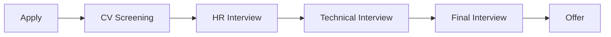

# Chuẩn bị phỏng vấn

Chuẩn bị kỹ lưỡng là chìa khóa để vượt qua phỏng vấn thành công. Trang này hướng dẫn cách chuẩn bị cho các vòng phỏng vấn IT.

## Quy trình phỏng vấn điển hình



| Vòng | Người phỏng vấn | Nội dung | Thời gian |
|------|-----------------|----------|-----------|
| **HR Interview** | HR/Recruiter | Giới thiệu, motivation, salary | 30-45 phút |
| **Technical Interview** | Tech Lead/Senior | Coding, technical knowledge | 60-90 phút |
| **Final Interview** | Manager/Director | Culture fit, career goals | 30-60 phút |

---

## Trước phỏng vấn

### 1. Research công ty

- **Website** - Sản phẩm, dịch vụ, mission, values
- **LinkedIn** - Quy mô, culture, employees
- **Glassdoor** - Reviews, interview experiences
- **Tech blog** - Tech stack, engineering culture
- **News** - Tin tức gần đây, funding, expansion

!!! tip "Câu hỏi để research"
    - Công ty làm gì? Sản phẩm/dịch vụ chính?
    - Đối thủ cạnh tranh là ai?
    - Tech stack họ sử dụng?
    - Culture như thế nào?
    - Có tin tức gì gần đây?

### 2. Đọc kỹ Job Description

Highlight các keywords và chuẩn bị ví dụ cho mỗi requirement:

```
Job Description                    Chuẩn bị
─────────────────────────────────────────────────────
"3+ years Java experience"    →    Liệt kê projects đã làm với Java
"Spring Boot"                 →    Ví dụ về Spring Boot projects
"RESTful APIs"                →    Giải thích REST principles, ví dụ
"Agile/Scrum"                 →    Kinh nghiệm làm việc Agile
"Problem-solving"             →    Ví dụ về giải quyết vấn đề khó
```

### 3. Chuẩn bị câu trả lời

#### STAR Method

Sử dụng STAR để trả lời câu hỏi behavioral:

- **S**ituation - Bối cảnh, context
- **T**ask - Nhiệm vụ, mục tiêu của bạn
- **A**ction - Hành động bạn đã làm
- **R**esult - Kết quả đạt được

```
Câu hỏi: "Kể về một lần bạn giải quyết conflict trong team"

STAR Answer:
S: "Trong dự án e-commerce, 2 senior developers không đồng ý 
   về cách implement payment module..."
   
T: "Là tech lead, tôi cần giải quyết conflict để project 
   không bị delay..."
   
A: "Tôi tổ chức meeting riêng với từng người để hiểu concerns,
   sau đó tổ chức technical discussion với cả team..."
   
R: "Chúng tôi đạt được consensus, implement hybrid solution,
   project hoàn thành đúng deadline..."
```

### 4. Chuẩn bị câu hỏi cho interviewer

Luôn có 3-5 câu hỏi để hỏi ngược:

```
Về team và công việc:
• Team hiện tại có bao nhiêu người? Cấu trúc như thế nào?
• Một ngày làm việc điển hình như thế nào?
• Dự án tôi sẽ tham gia nếu được nhận?

Về tech:
• Tech stack hiện tại và roadmap?
• Quy trình development như thế nào? (Agile, code review, CI/CD)
• Có cơ hội học công nghệ mới không?

Về growth:
• Career path cho vị trí này?
• Công ty có chương trình training/mentoring?
• Tiêu chí đánh giá performance?

Về culture:
• Điều gì khiến anh/chị thích làm việc ở đây?
• Team thường làm gì ngoài giờ làm việc?
```

---

## Trong phỏng vấn

### Mindset

- **Tự tin nhưng khiêm tốn** - Biết giá trị bản thân nhưng sẵn sàng học hỏi
- **Honest** - Không biết thì nói không biết, đừng bịa
- **Curious** - Thể hiện sự tò mò, ham học hỏi
- **Positive** - Không nói xấu công ty/đồng nghiệp cũ

### Body Language

- **Eye contact** - Nhìn vào mắt người phỏng vấn
- **Posture** - Ngồi thẳng, không khoanh tay
- **Smile** - Mỉm cười tự nhiên
- **Nod** - Gật đầu khi lắng nghe

### Khi không biết câu trả lời

```
❌ "Em không biết"

✅ "Em chưa có kinh nghiệm trực tiếp với X, nhưng em đã làm việc 
   với Y (tương tự). Em nghĩ approach sẽ là... Em có thể tìm hiểu 
   thêm và follow up sau được không?"

✅ "Đây là câu hỏi hay. Em cần suy nghĩ một chút... 
   [pause để suy nghĩ]"

✅ "Em chưa gặp case này, nhưng nếu gặp, em sẽ approach như sau..."
```

### Khi cần thời gian suy nghĩ

```
"Cho em một phút để suy nghĩ về câu hỏi này..."
"Đây là câu hỏi thú vị, em muốn đảm bảo trả lời đầy đủ..."
"Em có thể clarify một chút về [X] không?"
```

---

## Sau phỏng vấn

### Thank you email

Gửi trong vòng 24 giờ:

```
Subject: Thank you - Java Developer Interview

Dear [Interviewer Name],

Thank you for taking the time to interview me for the Java Developer 
position at [Company] today.

I enjoyed learning more about the team and the exciting projects 
you're working on, especially [specific project/topic discussed].

Our conversation reinforced my enthusiasm for this opportunity. 
I'm confident that my experience with [relevant skill] would allow 
me to contribute effectively to your team.

Please don't hesitate to contact me if you need any additional 
information. I look forward to hearing from you.

Best regards,
[Your Name]
[Phone]
[LinkedIn]
```

### Follow up

- **1 tuần** - Nếu chưa có phản hồi, gửi email follow up
- **2 tuần** - Follow up lần 2 nếu cần
- **Move on** - Nếu không có phản hồi sau 2 tuần, tiếp tục apply nơi khác

---

## Checklist chuẩn bị

### 1 tuần trước

- [ ] Research công ty kỹ lưỡng
- [ ] Đọc và phân tích JD
- [ ] Chuẩn bị câu trả lời cho common questions
- [ ] Review technical knowledge
- [ ] Chuẩn bị câu hỏi cho interviewer

### 1 ngày trước

- [ ] Confirm thời gian, địa điểm (hoặc link meeting)
- [ ] Chuẩn bị outfit
- [ ] In CV (nếu onsite)
- [ ] Test camera, mic (nếu online)
- [ ] Ngủ đủ giấc

### Ngày phỏng vấn

- [ ] Đến sớm 10-15 phút
- [ ] Mang theo CV, notebook, pen
- [ ] Tắt điện thoại
- [ ] Relax, take deep breaths

### Sau phỏng vấn

- [ ] Gửi thank you email
- [ ] Ghi chú những gì đã hỏi/trả lời
- [ ] Reflect và cải thiện cho lần sau

---

## Online Interview Tips

### Setup

- **Lighting** - Ánh sáng từ phía trước, không backlight
- **Background** - Sạch sẽ, không distracting
- **Camera** - Ngang tầm mắt
- **Internet** - Stable connection, có backup (4G)
- **Audio** - Test mic, dùng headphones

### During

- **Look at camera** - Không nhìn vào màn hình
- **Mute khi không nói** - Tránh noise
- **Share screen** - Chuẩn bị sẵn nếu cần code
- **Have water** - Để uống khi cần

### Backup plan

- Có số điện thoại của recruiter
- Chuẩn bị hotspot từ điện thoại
- Test tất cả trước 30 phút

---

## Tài nguyên

### Practice

- [Pramp](https://www.pramp.com/) - Mock interviews miễn phí
- [Interviewing.io](https://interviewing.io/) - Anonymous mock interviews

### Reading

- "Cracking the Coding Interview" - Gayle Laakmann McDowell
- "The Complete Software Developer's Career Guide" - John Sonmez

## Tiếp theo

- [Câu hỏi thường gặp](cau-hoi.md)
- [Phỏng vấn kỹ thuật](ky-thuat.md)
