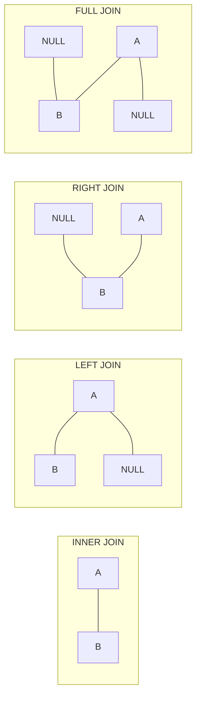

# JOIN

JOIN cho phép kết hợp dữ liệu từ nhiều bảng dựa trên mối quan hệ giữa chúng.

## Các loại JOIN



| Loại | Mô tả |
|------|-------|
| **INNER JOIN** | Chỉ lấy rows khớp ở cả 2 bảng |
| **LEFT JOIN** | Lấy tất cả rows từ bảng trái + rows khớp từ bảng phải |
| **RIGHT JOIN** | Lấy tất cả rows từ bảng phải + rows khớp từ bảng trái |
| **FULL JOIN** | Lấy tất cả rows từ cả 2 bảng |
| **CROSS JOIN** | Tích Descartes - mỗi row bảng A với mỗi row bảng B |

---

## Sample Data

```sql
-- Bảng customers
+----+----------+------------+
| id |   name   |    city    |
+----+----------+------------+
|  1 | Nguyen A | Ha Noi     |
|  2 | Tran B   | HCM        |
|  3 | Le C     | Da Nang    |
|  4 | Pham D   | Ha Noi     |
+----+----------+------------+

-- Bảng orders
+----+-------------+------------+--------+
| id | customer_id | order_date | total  |
+----+-------------+------------+--------+
|  1 |      1      | 2024-01-15 | 500000 |
|  2 |      1      | 2024-01-20 | 750000 |
|  3 |      2      | 2024-01-18 | 300000 |
|  4 |      5      | 2024-01-22 | 200000 |  -- customer_id 5 không tồn tại
+----+-------------+------------+--------+
```

---

## INNER JOIN

Chỉ trả về các rows có dữ liệu khớp ở **cả hai bảng**.

### Cú pháp

```sql
SELECT columns
FROM table1
INNER JOIN table2 ON table1.column = table2.column;
```

### Ví dụ

```sql
-- Lấy đơn hàng với thông tin khách hàng
SELECT 
    orders.id AS order_id,
    customers.name AS customer_name,
    orders.order_date,
    orders.total
FROM orders
INNER JOIN customers ON orders.customer_id = customers.id;

-- Kết quả: Chỉ có 3 rows (order id=4 không có customer)
+----------+---------------+------------+--------+
| order_id | customer_name | order_date | total  |
+----------+---------------+------------+--------+
|        1 | Nguyen A      | 2024-01-15 | 500000 |
|        2 | Nguyen A      | 2024-01-20 | 750000 |
|        3 | Tran B        | 2024-01-18 | 300000 |
+----------+---------------+------------+--------+
```

### Sử dụng Alias

```sql
SELECT 
    o.id AS order_id,
    c.name AS customer_name,
    o.total
FROM orders o
INNER JOIN customers c ON o.customer_id = c.id;
```

---

## LEFT JOIN (LEFT OUTER JOIN)

Trả về **tất cả rows từ bảng trái**, và rows khớp từ bảng phải. Nếu không khớp, trả về NULL.

```sql
-- Lấy tất cả khách hàng và đơn hàng của họ (nếu có)
SELECT 
    c.id AS customer_id,
    c.name,
    o.id AS order_id,
    o.total
FROM customers c
LEFT JOIN orders o ON c.id = o.customer_id;

-- Kết quả: Tất cả customers, kể cả không có orders
+-------------+----------+----------+--------+
| customer_id |   name   | order_id | total  |
+-------------+----------+----------+--------+
|           1 | Nguyen A |        1 | 500000 |
|           1 | Nguyen A |        2 | 750000 |
|           2 | Tran B   |        3 | 300000 |
|           3 | Le C     |     NULL |   NULL |  -- Không có order
|           4 | Pham D   |     NULL |   NULL |  -- Không có order
+-------------+----------+----------+--------+
```

### Tìm rows không có match

```sql
-- Khách hàng chưa có đơn hàng nào
SELECT c.*
FROM customers c
LEFT JOIN orders o ON c.id = o.customer_id
WHERE o.id IS NULL;
```

---

## RIGHT JOIN (RIGHT OUTER JOIN)

Trả về **tất cả rows từ bảng phải**, và rows khớp từ bảng trái.

```sql
-- Lấy tất cả đơn hàng và thông tin khách hàng (nếu có)
SELECT 
    o.id AS order_id,
    o.total,
    c.name AS customer_name
FROM customers c
RIGHT JOIN orders o ON c.id = o.customer_id;

-- Kết quả: Tất cả orders, kể cả không có customer
+----------+--------+---------------+
| order_id | total  | customer_name |
+----------+--------+---------------+
|        1 | 500000 | Nguyen A      |
|        2 | 750000 | Nguyen A      |
|        3 | 300000 | Tran B        |
|        4 | 200000 | NULL          |  -- customer_id 5 không tồn tại
+----------+--------+---------------+
```

---

## FULL OUTER JOIN

Trả về **tất cả rows từ cả hai bảng**. MySQL không hỗ trợ trực tiếp, cần dùng UNION.

```sql
-- PostgreSQL, SQL Server
SELECT c.name, o.id AS order_id
FROM customers c
FULL OUTER JOIN orders o ON c.id = o.customer_id;

-- MySQL: Dùng UNION
SELECT c.name, o.id AS order_id
FROM customers c
LEFT JOIN orders o ON c.id = o.customer_id
UNION
SELECT c.name, o.id AS order_id
FROM customers c
RIGHT JOIN orders o ON c.id = o.customer_id;
```

---

## CROSS JOIN

Tích Descartes - kết hợp mỗi row của bảng A với mỗi row của bảng B.

```sql
-- Tạo tất cả combinations
SELECT c.name, p.name AS product
FROM customers c
CROSS JOIN products p;

-- Nếu customers có 4 rows và products có 10 rows
-- Kết quả sẽ có 4 x 10 = 40 rows
```

---

## SELF JOIN

Join một bảng với chính nó.

```sql
-- Bảng employees với manager_id
+----+----------+------------+
| id |   name   | manager_id |
+----+----------+------------+
|  1 | CEO      |    NULL    |
|  2 | Manager A|      1     |
|  3 | Manager B|      1     |
|  4 | Staff 1  |      2     |
|  5 | Staff 2  |      2     |
+----+----------+------------+

-- Lấy nhân viên và tên manager
SELECT 
    e.name AS employee,
    m.name AS manager
FROM employees e
LEFT JOIN employees m ON e.manager_id = m.id;

-- Kết quả
+------------+-----------+
|  employee  |  manager  |
+------------+-----------+
| CEO        | NULL      |
| Manager A  | CEO       |
| Manager B  | CEO       |
| Staff 1    | Manager A |
| Staff 2    | Manager A |
+------------+-----------+
```

---

## Multiple JOINs

```sql
-- Lấy chi tiết đơn hàng với thông tin khách hàng và sản phẩm
SELECT 
    o.id AS order_id,
    c.name AS customer_name,
    p.name AS product_name,
    oi.quantity,
    oi.price,
    oi.quantity * oi.price AS subtotal
FROM orders o
INNER JOIN customers c ON o.customer_id = c.id
INNER JOIN order_items oi ON o.id = oi.order_id
INNER JOIN products p ON oi.product_id = p.id
WHERE o.order_date >= '2024-01-01'
ORDER BY o.id, p.name;
```

---

## JOIN với điều kiện phức tạp

```sql
-- JOIN với nhiều điều kiện
SELECT *
FROM orders o
INNER JOIN customers c 
    ON o.customer_id = c.id 
    AND c.status = 'active';

-- JOIN với BETWEEN
SELECT *
FROM products p
INNER JOIN price_history ph 
    ON p.id = ph.product_id
    AND CURDATE() BETWEEN ph.start_date AND ph.end_date;

-- JOIN với subquery
SELECT c.name, order_stats.total_orders, order_stats.total_amount
FROM customers c
INNER JOIN (
    SELECT customer_id, COUNT(*) AS total_orders, SUM(total) AS total_amount
    FROM orders
    GROUP BY customer_id
) order_stats ON c.id = order_stats.customer_id;
```

---

## Performance Tips

### Sử dụng Index

```sql
-- Tạo index trên foreign key
CREATE INDEX idx_orders_customer_id ON orders(customer_id);
CREATE INDEX idx_order_items_order_id ON order_items(order_id);
CREATE INDEX idx_order_items_product_id ON order_items(product_id);
```

### Chọn đúng loại JOIN

```sql
-- Nếu chỉ cần rows khớp, dùng INNER JOIN (nhanh hơn)
-- Nếu cần tất cả rows từ một bảng, dùng LEFT/RIGHT JOIN
```

### Giới hạn columns

```sql
-- BAD: SELECT *
SELECT * FROM orders o
INNER JOIN customers c ON o.customer_id = c.id;

-- GOOD: Chỉ lấy columns cần thiết
SELECT o.id, o.total, c.name
FROM orders o
INNER JOIN customers c ON o.customer_id = c.id;
```

---

## Bài tập thực hành

!!! example "Bài tập 1"
    Viết query:
    
    1. Lấy danh sách sản phẩm và tên category
    2. Lấy đơn hàng với tên khách hàng và tổng tiền
    3. Tìm sản phẩm chưa có trong đơn hàng nào

!!! example "Bài tập 2"
    Viết query thống kê:
    
    1. Tổng doanh thu theo khách hàng
    2. Số lượng sản phẩm bán được theo category
    3. Top 5 khách hàng mua nhiều nhất

## Tiếp theo

- [GROUP BY & HAVING](group-by.md)
