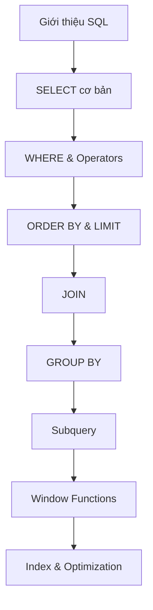

# SQL

SQL (Structured Query Language) là ngôn ngữ chuẩn để làm việc với cơ sở dữ liệu quan hệ.

## Tổng quan

### SQL là gì?

SQL là ngôn ngữ cho phép bạn:

- **Truy vấn dữ liệu** (SELECT)
- **Thêm dữ liệu** (INSERT)
- **Cập nhật dữ liệu** (UPDATE)
- **Xóa dữ liệu** (DELETE)
- **Tạo và quản lý cấu trúc** (CREATE, ALTER, DROP)

### Các hệ quản trị CSDL phổ biến

| DBMS | Đặc điểm | Use case |
|------|----------|----------|
| **MySQL** | Open source, phổ biến | Web applications |
| **PostgreSQL** | Advanced features, ACID | Enterprise, GIS |
| **SQL Server** | Microsoft, tích hợp .NET | Enterprise Windows |
| **Oracle** | Enterprise, high performance | Large enterprise |
| **SQLite** | Embedded, file-based | Mobile, desktop apps |

---

## Nội dung học tập

### Cơ bản

<div class="grid cards" markdown>

-   :material-database-search: **Giới thiệu SQL**

    ---

    Khái niệm cơ bản về database, tables, và SQL syntax

    [:octicons-arrow-right-24: Bắt đầu](basic/intro.md)

-   :material-table-search: **SELECT & WHERE**

    ---

    Truy vấn dữ liệu với điều kiện lọc

    [:octicons-arrow-right-24: Học ngay](basic/select-where.md)

-   :material-table-merge-cells: **JOIN**

    ---

    Kết hợp dữ liệu từ nhiều bảng

    [:octicons-arrow-right-24: Tìm hiểu](basic/join.md)

-   :material-group: **GROUP BY & HAVING**

    ---

    Nhóm và tổng hợp dữ liệu

    [:octicons-arrow-right-24: Khám phá](basic/group-by.md)

</div>

### Nâng cao

<div class="grid cards" markdown>

-   :material-code-parentheses: **Subquery**

    ---

    Truy vấn lồng nhau

    [:octicons-arrow-right-24: Học ngay](advanced/subquery.md)

-   :material-window-maximize: **Window Functions**

    ---

    Các hàm phân tích nâng cao

    [:octicons-arrow-right-24: Tìm hiểu](advanced/window-functions.md)

-   :material-speedometer: **Index & Performance**

    ---

    Tối ưu hiệu suất truy vấn

    [:octicons-arrow-right-24: Khám phá](advanced/index-performance.md)

</div>

### Thực hành

<div class="grid cards" markdown>

-   :material-code-braces: **Bài tập thực hành**

    ---

    Các bài tập SQL từ cơ bản đến nâng cao

    [:octicons-arrow-right-24: Làm bài](practice.md)

</div>

---

## Lộ trình học



---

## Yêu cầu

Để thực hành SQL, bạn cần:

1. **Cài đặt DBMS**: MySQL, PostgreSQL, hoặc SQLite
2. **Tool quản lý**: DBeaver, MySQL Workbench, pgAdmin
3. **Sample database**: Sử dụng database mẫu để thực hành

### Cài đặt MySQL

```bash
# Ubuntu/Debian
sudo apt update
sudo apt install mysql-server

# macOS (Homebrew)
brew install mysql

# Windows
# Download từ https://dev.mysql.com/downloads/
```

### Sample Database

```sql
-- Tạo database
CREATE DATABASE shop;
USE shop;

-- Tạo bảng customers
CREATE TABLE customers (
    id INT PRIMARY KEY AUTO_INCREMENT,
    name VARCHAR(100) NOT NULL,
    email VARCHAR(100) UNIQUE,
    created_at TIMESTAMP DEFAULT CURRENT_TIMESTAMP
);

-- Tạo bảng products
CREATE TABLE products (
    id INT PRIMARY KEY AUTO_INCREMENT,
    name VARCHAR(100) NOT NULL,
    price DECIMAL(10,2) NOT NULL,
    stock INT DEFAULT 0,
    category_id INT
);

-- Tạo bảng orders
CREATE TABLE orders (
    id INT PRIMARY KEY AUTO_INCREMENT,
    customer_id INT,
    order_date DATE,
    total DECIMAL(10,2),
    status VARCHAR(20) DEFAULT 'pending',
    FOREIGN KEY (customer_id) REFERENCES customers(id)
);

-- Tạo bảng order_items
CREATE TABLE order_items (
    id INT PRIMARY KEY AUTO_INCREMENT,
    order_id INT,
    product_id INT,
    quantity INT,
    price DECIMAL(10,2),
    FOREIGN KEY (order_id) REFERENCES orders(id),
    FOREIGN KEY (product_id) REFERENCES products(id)
);
```

---

## Bắt đầu

Sẵn sàng học SQL? Hãy bắt đầu với [Giới thiệu SQL](basic/intro.md)!
